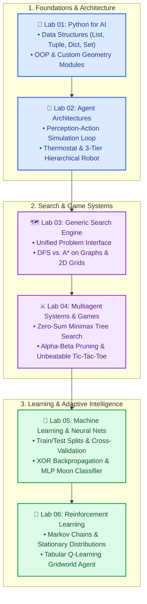
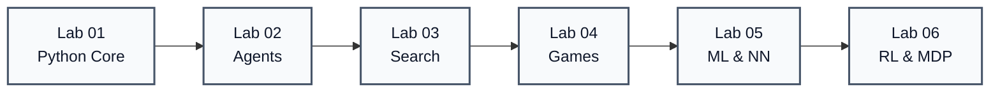
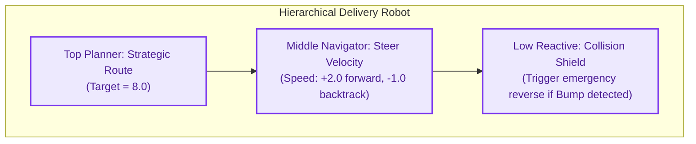
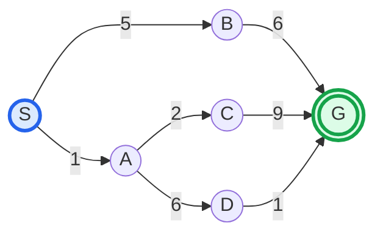
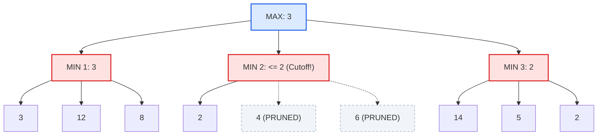
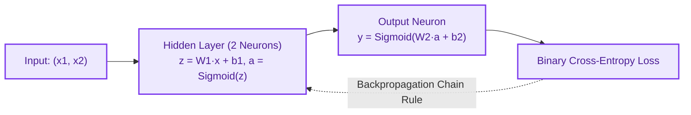
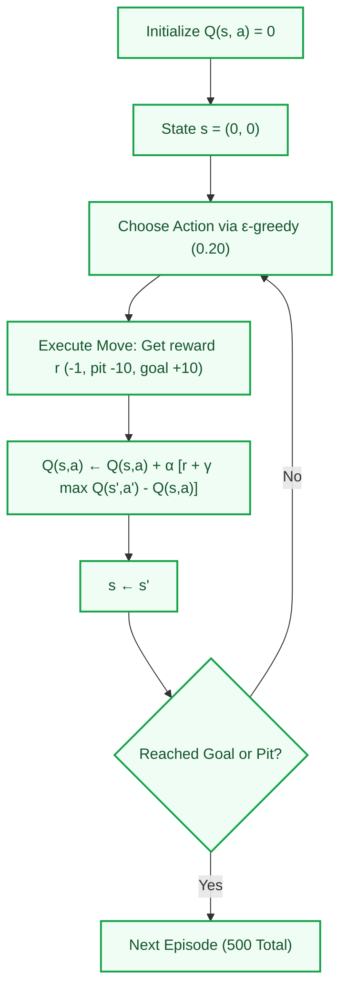

# CSE366: Artificial Intelligence Lab — Comprehensive Lab Manual & Code Repository

<p align="center">
  
  
  
  
  
  
</p>

---

## 🔬 Welcome to the AI Practical Laboratory

This laboratory companion contains **all 6 practical modules** for the **CSE366 (Artificial Intelligence)** course. Every lab bridges classroom theory with fully functioning, dependency-free and standard-library-first Python implementations.

### 📦 Repository Structure Overview

```
CSE366_AI_Lab/
├── CSE366_AI_Lab_Manual.docx             # Complete combined manual for all 6 labs
├── README.md                             # Global Lab Index & Master Documentation (This File)
├── Lab01_Python_Programming/             # Lab 01: Core Python for AI & Geometry Module
│   ├── basics.py
│   ├── geometry.py
│   ├── main.py
│   ├── Lab01_Python_Programming.docx
│   └── README.md
├── Lab02_Agent_Architectures/            # Lab 02: Simple Reflex, Model-Based & Hierarchical Agents
│   ├── thermostat_agent.py
│   ├── hierarchical_robot.py
│   ├── Lab02_Agent_Architectures.docx
│   └── README.md
├── Lab03_Search/                         # Lab 03: Generic Search Engine (DFS & A*) on Graphs & Grids
│   ├── generic_search.py
│   ├── grid_search.py
│   ├── Lab03_Search.docx
│   └── README.md
├── Lab04_Multiagent_Games/               # Lab 04: Minimax, Alpha-Beta Pruning & Tic-Tac-Toe AI
│   ├── minimax_tree.py
│   ├── tictactoe.py
│   ├── Lab04_Multiagent_Games.docx
│   └── README.md
├── Lab05_Machine_Learning/               # Lab 05: Supervised Regressors, Overfitting, XOR & MLPs
│   ├── supervised_basics.py
│   ├── overfitting_regularization_cv.py
│   ├── xor_backprop.py
│   ├── mlp_moons.py
│   ├── Lab05_Machine_Learning.docx
│   └── README.md
└── Lab06_Reinforcement_Learning/         # Lab 06: Markov Chains, Stationary States & Q-Learning Gridworld
    ├── markov_chain.py
    ├── q_learning_gridworld.py
    ├── Lab06_Reinforcement_Learning.docx
    └── README.md
```

---

## 🗺️ Interactive Lab Curriculum Roadmap



---

## ⚙️ Environment Setup & Prerequisites

### 1. Requirements
- **Python:** 3.10 or newer (tested up to Python 3.12).
- **Core Scientific Libraries:** `numpy`, `scikit-learn`, `matplotlib`.

### 2. One-Time Installation

```bash
# Clone the repository and navigate to the lab root
cd CSE366_AI_Lab

# (Optional but recommended) Create and activate a virtual environment
python3 -m venv venv
source venv/bin/activate       # On macOS/Linux
# .\venv\Scripts\activate      # On Windows

# Install all required dependencies
pip install --upgrade pip
pip install numpy scikit-learn matplotlib
```

### 3. Verify Your Environment

```bash
python -c "import numpy, sklearn, matplotlib; print('✓ Environment setup complete and all AI libraries verified!')"
```

---

## 📑 Lab-by-Lab Detailed Directory



---

### [Lab 01 — Introduction to Python Programming](file:///Users/shimulkumarshoishob/Documents/CAPSTON_PROJECT/AntiGravity_IDE/Artificial_Intelligence_CSE366/CSE366_AI_Lab/Lab01_Python_Programming)

> **Focus:** Essential Python data structures, list comprehensions, object-oriented design, modular architecture, and standard search primitives (`deque`, `heapq`).

- 📄 **Documentation:** [Lab01_Python_Programming/README.md](file:///Users/shimulkumarshoishob/Documents/CAPSTON_PROJECT/AntiGravity_IDE/Artificial_Intelligence_CSE366/CSE366_AI_Lab/Lab01_Python_Programming/README.md)
- 📝 **Docx Lab Sheet:** `Lab01_Python_Programming.docx`

| File | Description | Execution Command |
| :--- | :--- | :--- |
| [`basics.py`](file:///Users/shimulkumarshoishob/Documents/CAPSTON_PROJECT/AntiGravity_IDE/Artificial_Intelligence_CSE366/CSE366_AI_Lab/Lab01_Python_Programming/basics.py) | Covers data types, dictionary mappings, sets for visited states, list comprehensions, and Student class modeling. | `python basics.py` |
| [`geometry.py`](file:///Users/shimulkumarshoishob/Documents/CAPSTON_PROJECT/AntiGravity_IDE/Artificial_Intelligence_CSE366/CSE366_AI_Lab/Lab01_Python_Programming/geometry.py) | Reusable AI distance heuristics: Euclidean distance ($L_2$) and Manhattan distance ($L_1$). | — *(Imported module)* |
| [`main.py`](file:///Users/shimulkumarshoishob/Documents/CAPSTON_PROJECT/AntiGravity_IDE/Artificial_Intelligence_CSE366/CSE366_AI_Lab/Lab01_Python_Programming/main.py) | Imports custom geometry heuristics, tests pseudo-random seeding, FIFO queue (`deque`), and priority queue (`heapq`). | `python main.py` |

#### Data Structures for AI Quick Reference
- **Lists (`[]`):** Path trajectories, population sets in GAs, FIFO queues with `deque`.
- **Tuples (`(r, c)`):** Grid coordinate positions, immutable state keys for dictionaries.
- **Dictionaries (`{}`):** Adjacency lists (Graph node $\rightarrow$ neighbors), Q-tables (`(s, a)` $\rightarrow Q$).
- **Sets (`set()`):** Graph search closed/explored lists ($O(1)$ constant-time membership checks).

---

### [Lab 02 — Agent Architectures and Hierarchical Control](file:///Users/shimulkumarshoishob/Documents/CAPSTON_PROJECT/AntiGravity_IDE/Artificial_Intelligence_CSE366/CSE366_AI_Lab/Lab02_Agent_Architectures)

> **Focus:** Abstracting the Perception-Action environment loop and building layered hierarchical controllers separating strategic planning, navigation, and reactive collision avoidance.

- 📄 **Documentation:** [Lab02_Agent_Architectures/README.md](file:///Users/shimulkumarshoishob/Documents/CAPSTON_PROJECT/AntiGravity_IDE/Artificial_Intelligence_CSE366/CSE366_AI_Lab/Lab02_Agent_Architectures/README.md)
- 📝 **Docx Lab Sheet:** `Lab02_Agent_Architectures.docx`



| File | Description | Execution Command |
| :--- | :--- | :--- |
| [`thermostat_agent.py`](file:///Users/shimulkumarshoishob/Documents/CAPSTON_PROJECT/AntiGravity_IDE/Artificial_Intelligence_CSE366/CSE366_AI_Lab/Lab02_Agent_Architectures/thermostat_agent.py) | Simulation of a Room environment and a stateful Model-Based Reflex Thermostat with temperature hysteresis ($20^\circ\text{C} - 22^\circ\text{C}$). | `python thermostat_agent.py` |
| [`hierarchical_robot.py`](file:///Users/shimulkumarshoishob/Documents/CAPSTON_PROJECT/AntiGravity_IDE/Artificial_Intelligence_CSE366/CSE366_AI_Lab/Lab02_Agent_Architectures/hierarchical_robot.py) | 3-Layer Hierarchical Controller for a 1D Delivery Robot navigating around random dynamic bump obstacles. | `python hierarchical_robot.py` |

---

### [Lab 03 — Searching for Solutions](file:///Users/shimulkumarshoishob/Documents/CAPSTON_PROJECT/AntiGravity_IDE/Artificial_Intelligence_CSE366/CSE366_AI_Lab/Lab03_Search)

> **Focus:** Building a unified, extensible `SearchProblem` interface and executing Depth-First Search (DFS) and A\* Search on both symbolic state graphs and 2D grid mazes.

- 📄 **Documentation:** [Lab03_Search/README.md](file:///Users/shimulkumarshoishob/Documents/CAPSTON_PROJECT/AntiGravity_IDE/Artificial_Intelligence_CSE366/CSE366_AI_Lab/Lab03_Search/README.md)
- 📝 **Docx Lab Sheet:** `Lab03_Search.docx`



| File | Description | Execution Command |
| :--- | :--- | :--- |
| [`generic_search.py`](file:///Users/shimulkumarshoishob/Documents/CAPSTON_PROJECT/AntiGravity_IDE/Artificial_Intelligence_CSE366/CSE366_AI_Lab/Lab03_Search/generic_search.py) | Implements `SearchProblem`, `GraphProblem`, and the unified `generic_search()` engine comparing DFS and A\* on the Chapter 2 & 3 benchmark graph. | `python generic_search.py` |
| [`grid_search.py`](file:///Users/shimulkumarshoishob/Documents/CAPSTON_PROJECT/AntiGravity_IDE/Artificial_Intelligence_CSE366/CSE366_AI_Lab/Lab03_Search/grid_search.py) | Solves a 2D Grid Maze ($5 \times 7$ grid with obstacle walls `'#'`) using Manhattan heuristic $h(n) = |r_1 - r_2| + |c_1 - c_2|$. | `python grid_search.py` |

---

### [Lab 04 — Multiagent Systems & Game Playing](file:///Users/shimulkumarshoishob/Documents/CAPSTON_PROJECT/AntiGravity_IDE/Artificial_Intelligence_CSE366/CSE366_AI_Lab/Lab04_Multiagent_Games)

> **Focus:** Adversarial zero-sum games, game-tree evaluation, leaf pruning via $\alpha$-$\beta$ cutoffs, and developing an optimal Tic-Tac-Toe AI.

- 📄 **Documentation:** [Lab04_Multiagent_Games/README.md](file:///Users/shimulkumarshoishob/Documents/CAPSTON_PROJECT/AntiGravity_IDE/Artificial_Intelligence_CSE366/CSE366_AI_Lab/Lab04_Multiagent_Games/README.md)
- 📝 **Docx Lab Sheet:** `Lab04_Multiagent_Games.docx`



| File | Description | Execution Command |
| :--- | :--- | :--- |
| [`minimax_tree.py`](file:///Users/shimulkumarshoishob/Documents/CAPSTON_PROJECT/AntiGravity_IDE/Artificial_Intelligence_CSE366/CSE366_AI_Lab/Lab04_Multiagent_Games/minimax_tree.py) | Executes `minimax()` vs `alphabeta()` on nested tree structures, proving identical optimal values ($3$) while recording pruned leaf branches ($7$ leaves vs $9$). | `python minimax_tree.py` |
| [`tictactoe.py`](file:///Users/shimulkumarshoishob/Documents/CAPSTON_PROJECT/AntiGravity_IDE/Artificial_Intelligence_CSE366/CSE366_AI_Lab/Lab04_Multiagent_Games/tictactoe.py) | Full terminal-interactive Tic-Tac-Toe game where human plays against an unbeatable AI using depth-aware minimax. | `python tictactoe.py` |

---

### [Lab 05 — Introduction to Machine Learning & Neural Networks](file:///Users/shimulkumarshoishob/Documents/CAPSTON_PROJECT/AntiGravity_IDE/Artificial_Intelligence_CSE366/CSE366_AI_Lab/Lab05_Machine_Learning)

> **Focus:** Supervised learning foundations, bias-variance tradeoff, $k$-fold cross-validation, Ridge regularization, manually coded XOR backpropagation, and multi-layer perceptron non-linear classification.

- 📄 **Documentation:** [Lab05_Machine_Learning/README.md](file:///Users/shimulkumarshoishob/Documents/CAPSTON_PROJECT/AntiGravity_IDE/Artificial_Intelligence_CSE366/CSE366_AI_Lab/Lab05_Machine_Learning/README.md)
- 📝 **Docx Lab Sheet:** `Lab05_Machine_Learning.docx`



| File | Description | Execution Command |
| :--- | :--- | :--- |
| [`supervised_basics.py`](file:///Users/shimulkumarshoishob/Documents/CAPSTON_PROJECT/AntiGravity_IDE/Artificial_Intelligence_CSE366/CSE366_AI_Lab/Lab05_Machine_Learning/supervised_basics.py) | Compares baseline dummy mean predictor vs. linear regression for synthetic flat rent prediction ($y = 2.0x + 5.0$). | `python supervised_basics.py` |
| [`overfitting_regularization_cv.py`](file:///Users/shimulkumarshoishob/Documents/CAPSTON_PROJECT/AntiGravity_IDE/Artificial_Intelligence_CSE366/CSE366_AI_Lab/Lab05_Machine_Learning/overfitting_regularization_cv.py) | Polynomial curve fitting (Degrees 1, 3, 12), illustrating overfitting on Degree 12 and recovery via Ridge Regularization ($\alpha=0.1$) & 5-fold CV. | `python overfitting_regularization_cv.py` |
| [`xor_backprop.py`](file:///Users/shimulkumarshoishob/Documents/CAPSTON_PROJECT/AntiGravity_IDE/Artificial_Intelligence_CSE366/CSE366_AI_Lab/Lab05_Machine_Learning/xor_backprop.py) | From-scratch 2-2-1 Neural Network solving the non-linearly separable XOR problem using NumPy forward & backward propagation. | `python xor_backprop.py` |
| [`mlp_moons.py`](file:///Users/shimulkumarshoishob/Documents/CAPSTON_PROJECT/AntiGravity_IDE/Artificial_Intelligence_CSE366/CSE366_AI_Lab/Lab05_Machine_Learning/mlp_moons.py) | Trains a Scikit-Learn `MLPClassifier` with ReLU activations on the non-linear two-moons dataset, achieving $>95\%$ test accuracy. | `python mlp_moons.py` |

---

### [Lab 06 — Reinforcement Learning & MDPs](file:///Users/shimulkumarshoishob/Documents/CAPSTON_PROJECT/AntiGravity_IDE/Artificial_Intelligence_CSE366/CSE366_AI_Lab/Lab06_Reinforcement_Learning)

> **Focus:** Markov chains, multi-step transition matrices, stationary distribution analysis ($\pi = \pi P$), and model-free Tabular Q-Learning in a stochastic Gridworld.

- 📄 **Documentation:** [Lab06_Reinforcement_Learning/README.md](file:///Users/shimulkumarshoishob/Documents/CAPSTON_PROJECT/AntiGravity_IDE/Artificial_Intelligence_CSE366/CSE366_AI_Lab/Lab06_Reinforcement_Learning/README.md)
- 📝 **Docx Lab Sheet:** `Lab06_Reinforcement_Learning.docx`



| File | Description | Execution Command |
| :--- | :--- | :--- |
| [`markov_chain.py`](file:///Users/shimulkumarshoishob/Documents/CAPSTON_PROJECT/AntiGravity_IDE/Artificial_Intelligence_CSE366/CSE366_AI_Lab/Lab06_Reinforcement_Learning/markov_chain.py) | Weather Markov process simulation (Sunny/Rainy), $n$-step state distribution matrix multiplication, and stationary eigenvector calculation ($\pi = [0.667, 0.333]$). | `python markov_chain.py` |
| [`q_learning_gridworld.py`](file:///Users/shimulkumarshoishob/Documents/CAPSTON_PROJECT/AntiGravity_IDE/Artificial_Intelligence_CSE366/CSE366_AI_Lab/Lab06_Reinforcement_Learning/q_learning_gridworld.py) | $3 \times 4$ Gridworld with Pit `(1, 1)` and Goal `(0, 3)`. Learns the optimal navigation policy $\pi^*(s)$ through 500 episodes of Q-Learning. | `python q_learning_gridworld.py` |

---

## ⚡ Master Execution Cheat-Sheet

You can test and run any lab script directly from the project root using standard Python invocations:

```bash
# Lab 01: Python Foundations
python CSE366_AI_Lab/Lab01_Python_Programming/basics.py
python CSE366_AI_Lab/Lab01_Python_Programming/main.py

# Lab 02: Agent Architectures & Control
python CSE366_AI_Lab/Lab02_Agent_Architectures/thermostat_agent.py
python CSE366_AI_Lab/Lab02_Agent_Architectures/hierarchical_robot.py

# Lab 03: Generic Search & Maze Solving
python CSE366_AI_Lab/Lab03_Search/generic_search.py
python CSE366_AI_Lab/Lab03_Search/grid_search.py

# Lab 04: Adversarial Games & Minimax
python CSE366_AI_Lab/Lab04_Multiagent_Games/minimax_tree.py
python CSE366_AI_Lab/Lab04_Multiagent_Games/tictactoe.py

# Lab 05: Machine Learning & Backpropagation
python CSE366_AI_Lab/Lab05_Machine_Learning/supervised_basics.py
python CSE366_AI_Lab/Lab05_Machine_Learning/overfitting_regularization_cv.py
python CSE366_AI_Lab/Lab05_Machine_Learning/xor_backprop.py
python CSE366_AI_Lab/Lab05_Machine_Learning/mlp_moons.py

# Lab 06: Reinforcement Learning & MDPs
python CSE366_AI_Lab/Lab06_Reinforcement_Learning/markov_chain.py
python CSE366_AI_Lab/Lab06_Reinforcement_Learning/q_learning_gridworld.py
```

---

## 🔗 Theory-to-Lab Cross-Reference Matrix

This matrix maps each practical laboratory module directly to the theoretical foundations covered in the main [Course Handbook](../README.md):

| Practical Lab Module | Primary Theoretical Chapter | Key Algorithmic Concepts Applied |
| :--- | :--- | :--- |
| **Lab 01: Python Programming** | [Chapter 01 & 02](../README.md#chapter-01--artificial-intelligence-and-agents) | $L_1$/$L_2$ Distance Metrics, FIFO/LIFO Data Structures, Heuristics |
| **Lab 02: Agent Architectures** | [Chapter 01: AI & Agents](../README.md#13-agent-architectures--hierarchical-control) | PEAS Framework, Model-Based Reflex, 3-Layer Hierarchical Controller |
| **Lab 03: Search Solutions** | [Chapter 02 & 03: Uninformed & Informed](../README.md#chapter-03--informed-heuristic-search) | Depth-First Search (LIFO), A\* Priority Queue ($f = g + h$), Maze Solving |
| **Lab 04: Multiagent Games** | [Chapter 05: Adversarial Search](../README.md#chapter-05--adversarial-search--games) | Zero-Sum Formulation, Minimax Tree Search, $\alpha$-$\beta$ Branch Pruning |
| **Lab 05: Machine Learning** | [Chapter 07: Learning in AI](../README.md#chapter-07--learning-in-ai--neural-networks) | Linear Regression, Polynomial Overfitting, Ridge ($L_2$), XOR Backprop |
| **Lab 06: Reinforcement Learning** | [Chapter 10 & 11: MDPs & RL](../README.md#chapter-11--reinforcement-learning-rl) | Markov Chains, Stationary States, Bellman Target, Tabular Q-Learning |

---

## 🎯 Viva Voce & Lab Exam Success Guide

<details>
<summary><b>💬 High-Yield Viva Question 1:</b> Why does Alpha-Beta pruning produce the exact same move as Minimax while examining fewer nodes?</summary>

Alpha-Beta pruning maintains dynamic bounds: $\alpha$ (highest value guaranteed to MAX) and $\beta$ (lowest value guaranteed to MIN). As soon as $\alpha \ge \beta$ at any node, the parent player can guarantee a better outcome via an alternate branch, rendering the remaining children irrelevant to the final decision.
</details>

<details>
<summary><b>💬 High-Yield Viva Question 2:</b> In A* search, why must the explored set be stored as a Python <code>set</code> rather than a <code>list</code>?</summary>

Checking membership in a Python `list` (`if node in explored`) requires linear search ($O(N)$ time), which causes the overall search to degrade to quadratic time $O(N^2)$. A Python `set` uses hash tables for $O(1)$ constant-time lookup.
</details>

<details>
<summary><b>💬 High-Yield Viva Question 3:</b> Why can a single-layer perceptron never solve the XOR classification problem?</summary>

A single neuron without a hidden layer can only construct a linear decision hyperplane (a straight line in 2D). XOR is non-linearly separable because $(0, 0)$ and $(1, 1)$ yield $0$, while $(0, 1)$ and $(1, 0)$ yield $1$. A hidden layer with non-linear activations (Sigmoid or ReLU) is required to warp the input space into a linearly separable representation.
</details>

<details>
<summary><b>💬 High-Yield Viva Question 4:</b> What is the difference between on-policy (SARSA) and off-policy (Q-Learning) reinforcement learning?</summary>

- **Q-Learning (Off-Policy):** Updates the Q-value assuming the agent will take the absolute greedy optimal action in the next state ($\max_{a'} Q(s', a')$), regardless of the actual exploratory action taken.
- **SARSA (On-Policy):** Updates the Q-value using the actual action $a'$ selected by the current behavioral policy (including $\epsilon$-greedy exploratory random moves).
</details>

---

<p align="center">
  <b>CSE366 Artificial Intelligence Laboratory Manual</b><br>
  Designed for practical mastery and academic excellence. Happy Coding & Best of Luck with your Lab Evaluations!
</p>
