# Artificial Intelligence (CSE366) — Comprehensive Course Handbook & Study Guide

<p align="center">
  
  
  
  
  
</p>

---

## 📖 Welcome & Overview

Welcome to the **complete, student-first course companion for CSE366 (Artificial Intelligence)**. This handbook distills every major topic across the 11 core chapters into plain English, intuitive diagrams, step-by-step mathematical derivations, exam-proven tracing tables, and runnable Python implementations.

### 🎯 How to Use These Notes

1. **Read the "In One Line" summary first:** Grasp the core philosophy and objective before diving into mechanics.
2. **Follow the Worked Examples & Traces:** Midterms and finals prioritize manual step-by-step traces (e.g., BFS/A\* queues, $\alpha$-$\beta$ cutoffs, CPT joint distributions, Q-learning value tables).
3. **Inspect the Python Snippets:** Cement your conceptual understanding with concise, dependency-free reference code.
4. **Leverage the Quick Reference Tables:** Use the algorithm comparison and complexity matrices right before your exams.
5. **Solve the Practice Flash Questions:** Test your active recall at the end of each chapter.

> [!NOTE]
> **The Running Real-World Example:**
> A **food-delivery rider in Dhaka** (navigating between Dhanmondi, Gulshan, and Mirpur) appears across chapters. It illustrates how one agent can use **search** to route, **heuristics** to estimate distances, **game theory** to outsmart competition, **logic** to troubleshoot bike issues, **probability** to manage traffic delays, and **reinforcement learning** to discover optimal delivery strategies.

---

## 🗺️ Visual Course Roadmap

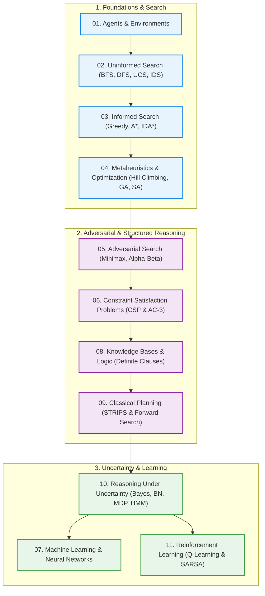

---

## 📑 Table of Contents

- [Chapter 01 — Artificial Intelligence and Agents](#chapter-01--artificial-intelligence-and-agents)
  - [1.1 Introduction to Artificial Intelligence](#11-introduction-to-artificial-intelligence)
  - [1.2 Agents & Environments (PEAS Framework)](#12-agents--environments-peas-framework)
  - [1.3 Agent Architectures & Hierarchical Control](#13-agent-architectures--hierarchical-control)
  - [Chapter 1 Quick Check](#chapter-1-quick-check)
- [Chapter 02 — Uninformed Search](#chapter-02--uninformed-search)
  - [2.1 Search Graph Formulation](#21-search-graph-formulation)
  - [2.2 Breadth-First Search (BFS)](#22-breadth-first-search-bfs)
  - [2.3 Depth-First Search (DFS)](#23-depth-first-search-dfs)
  - [2.4 Uniform Cost Search (UCS)](#24-uniform-cost-search-ucs)
  - [2.5 Depth-Limited (DLS) & Iterative Deepening (IDS)](#25-depth-limited-dls--iterative-deepening-ids)
  - [2.6 Bidirectional Search](#26-bidirectional-search)
  - [2.7 Python Reference: Uninformed Search Algorithms](#27-python-reference-uninformed-search-algorithms)
  - [Chapter 2 Quick Check](#chapter-2-quick-check)
- [Chapter 03 — Informed (Heuristic) Search](#chapter-03--informed-heuristic-search)
  - [3.1 Heuristic Functions, Admissibility & Consistency](#31-heuristic-functions-admissibility--consistency)
  - [3.2 Greedy Best-First Search](#32-greedy-best-first-search)
  - [3.3 A\* Search](#33-a-search)
  - [3.4 IDA\* (Iterative Deepening A\*)](#34-ida-iterative-deepening-a)
  - [3.5 Python Reference: A\* Search Engine](#35-python-reference-a-search-engine)
  - [Chapter 3 Quick Check](#chapter-3-quick-check)
- [Chapter 04 — Metaheuristic Algorithms](#chapter-04--metaheuristic-algorithms)
  - [4.1 Hill Climbing & Landscape Hazards](#41-hill-climbing--landscape-hazards)
  - [4.2 Hill Climbing Variations](#42-hill-climbing-variations)
  - [4.3 Simulated Annealing](#43-simulated-annealing)
  - [4.4 Genetic Algorithms (GA)](#44-genetic-algorithms-ga)
  - [4.5 Differential Evolution (DE)](#45-differential-evolution-de)
  - [4.6 Gradient Descent](#46-gradient-descent)
  - [4.7 Python Reference: Optimization in Action](#47-python-reference-optimization-in-action)
  - [Chapter 4 Quick Check](#chapter-4-quick-check)
- [Chapter 05 — Adversarial Search & Games](#chapter-05--adversarial-search--games)
  - [5.1 Game Formulations & Game Trees](#51-game-formulations--game-trees)
  - [5.2 The Minimax Algorithm](#52-the-minimax-algorithm)
  - [5.3 Alpha-Beta Pruning ($\alpha$-$\beta$)](#53-alpha-beta-pruning-)
  - [5.4 Python Reference: Minimax & Alpha-Beta Engine](#54-python-reference-minimax--alpha-beta-engine)
  - [Chapter 5 Quick Check](#chapter-5-quick-check)
- [Chapter 06 — Constraint Satisfaction Problems (CSPs)](#chapter-06--constraint-satisfaction-problems-csps)
  - [6.1 CSP Formalism & Constraint Graphs](#61-csp-formalism--constraint-graphs)
  - [6.2 Constraint Propagation: Forward Checking & AC-3](#62-constraint-propagation-forward-checking--ac-3)
  - [6.3 Backtracking Search with MRV, Degree & LCV](#63-backtracking-search-with-mrv-degree--lcv)
  - [6.4 Python Reference: CSP Solver](#64-python-reference-csp-solver)
  - [Chapter 6 Quick Check](#chapter-6-quick-check)
- [Chapter 07 — Learning in AI & Neural Networks](#chapter-07--learning-in-ai--neural-networks)
  - [7.1 Foundations of Machine Learning](#71-foundations-of-machine-learning)
  - [7.2 Artificial Neural Networks & Activation Functions](#72-artificial-neural-networks--activation-functions)
  - [7.3 The Backpropagation Algorithm](#73-the-backpropagation-algorithm)
  - [7.4 Python Reference: Neural Network Forward & Backprop Pass](#74-python-reference-neural-network-forward--backprop-pass)
  - [Chapter 7 Quick Check](#chapter-7-quick-check)
- [Chapter 08 — Knowledge Bases & Logic](#chapter-08--knowledge-bases--logic)
  - [8.1 Propositional Logic & Models](#81-propositional-logic--models)
  - [8.2 Definite Clauses & Horn Clauses](#82-definite-clauses--horn-clauses)
  - [8.3 Proof Procedures: Forward & Backward Chaining](#83-proof-procedures-forward--backward-chaining)
  - [8.4 Ask-the-User & Knowledge-Level Debugging](#84-ask-the-user--knowledge-level-debugging)
  - [8.5 Consistency-Based Diagnosis & Minimal Conflicts](#85-consistency-based-diagnosis--minimal-conflicts)
  - [8.6 Python Reference: Forward Chaining Engine](#86-python-reference-forward-chaining-engine)
  - [Chapter 8 Quick Check](#chapter-8-quick-check)
- [Chapter 09 — Classical Planning with Certainty](#chapter-09--classical-planning-with-certainty)
  - [9.1 Action Representations & The STRIPS Assumption](#91-action-representations--the-strips-assumption)
  - [9.2 Forward State-Space Planning vs Backward Planning](#92-forward-state-space-planning-vs-backward-planning)
  - [9.3 Python Reference: STRIPS Planning Engine](#93-python-reference-strips-planning-engine)
  - [Chapter 9 Quick Check](#chapter-9-quick-check)
- [Chapter 10 — Reasoning Under Uncertainty](#chapter-10--reasoning-under-uncertainty)
  - [10.1 Probability Basics & Bayes' Rule](#101-probability-basics--bayes-rule)
  - [10.2 Conditional Independence & Network Topologies](#102-conditional-independence--network-topologies)
  - [10.3 Bayesian Belief Networks (BBN)](#103-bayesian-belief-networks-bbn)
  - [10.4 Bayesian Parameter Learning](#104-bayesian-parameter-learning)
  - [10.5 Markov Decision Processes (MDPs) & The Bellman Equation](#105-markov-decision-processes-mdps--the-bellman-equation)
  - [10.6 Hidden Markov Models (HMMs)](#106-hidden-markov-models-hmms)
  - [10.7 Python Reference: Bayesian & HMM Computing](#107-python-reference-bayesian--hmm-computing)
  - [Chapter 10 Quick Check](#chapter-10-quick-check)
- [Chapter 11 — Reinforcement Learning (RL)](#chapter-11--reinforcement-learning-rl)
  - [11.1 The Reinforcement Learning Paradigm](#111-the-reinforcement-learning-paradigm)
  - [11.2 Passive vs Active RL, TD-Learning & SARSA](#112-passive-vs-active-rl-td-learning--sarsa)
  - [11.3 Exploration vs Exploitation ($\epsilon$-Greedy)](#113-exploration-vs-exploitation--greedy)
  - [11.4 Q-Learning (Off-Policy TD Control)](#114-q-learning-off-policy-td-control)
  - [11.5 Python Reference: Tabular Q-Learning Engine](#115-python-reference-tabular-q-learning-engine)
  - [Chapter 11 Quick Check](#chapter-11-quick-check)
- [🏆 Master Exam Cheat Sheet & Formulas](#-master-exam-cheat-sheet--formulas)

---

## Chapter 01 — Artificial Intelligence and Agents

> **In One Line:** AI builds rational agents that perceive their environment through sensors, reason over internal models, and act through actuators to maximize performance.

### 1.1 Introduction to Artificial Intelligence

Artificial Intelligence (AI) designs computational systems capable of performing tasks typically requiring human intelligence: reasoning, visual perception, natural language understanding, learning, and planning.

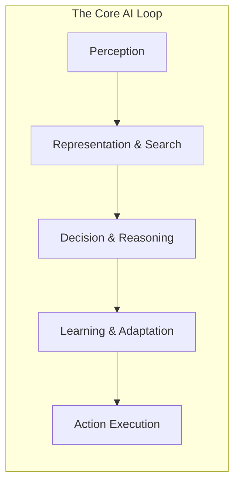

#### Core Foundational Pillars
1. **Representation:** Modeling facts, constraints, and relationships in computational structures (graphs, trees, logic clauses).
2. **Search:** Exploring prospective action trajectories to locate goal states.
3. **Reasoning:** Deriving logically sound inferences from existing knowledge.
4. **Learning:** Refining decision policies automatically from experiential data.
5. **Handling Uncertainty:** Making optimal decisions despite noisy, incomplete, or stochastic environments.

---

### 1.2 Agents & Environments (PEAS Framework)

An **agent** interacts with an **environment** in a continuous loop:

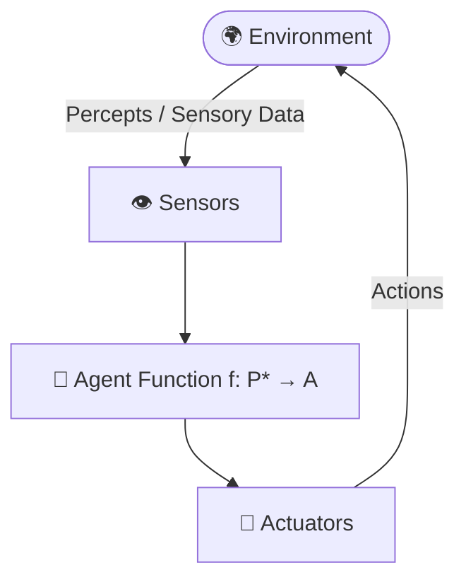

- **Percept:** The current sensory input.
- **Percept Sequence ($P^*$):** The complete history of all sensory inputs received to date.
- **Agent Function:** An abstract mathematical mapping from percept sequences to actions ($f: P^* \rightarrow A$).
- **Agent Program:** The concrete software implementation executing the agent function on a physical architecture.

#### PEAS Framework (Performance, Environment, Actuators, Sensors)

| System | Performance Measure (P) | Environment (E) | Actuators (A) | Sensors (S) |
| :--- | :--- | :--- | :--- | :--- |
| **Pathao / Uber Driver Agent** | Fast trip, safety, fuel efficiency, passenger rating | Dhaka roads, pedestrians, traffic jams, weather | Steering, throttle, brake, horn, app UI | GPS, camera, speedometer, accelerometer |
| **Medical Diagnostic Agent** | Diagnostic accuracy, minimized cost/risk, speed | Patient records, symptoms, lab test results | Screen display, prescription generation | Keyboard input, lab feed, EHR database |
| **Autonomous Vacuum Cleaner** | Cleanliness, energy usage, minimal wear, low noise | Rooms, carpet/tiles, furniture, stairs | Wheels, brushes, suction motor | Bump switch, infrared cliff sensor, dirt sensor |

#### Environmental Dimensions & Taxonomies

```
                  ┌── Fully Observable vs Partially Observable
                  ├── Deterministic vs Stochastic
Environment ──────┼── Episodic vs Sequential
Dimensions        ├── Static vs Dynamic
                  ├── Discrete vs Continuous
                  └── Single-Agent vs Multi-Agent (Competitive / Cooperative)
```

| Dimension | Easy Setting | Hard Setting | Real-World Hard Case Example |
| :--- | :--- | :--- | :--- |
| **Observability** | Fully Observable (Chess) | Partially Observable | Poker (hidden opponent hands), Foggy driving |
| **Determinism** | Deterministic (8-Puzzle) | Stochastic | Driving in Dhaka traffic (unpredictable actors) |
| **Episodicity** | Episodic (Image classification) | Sequential | Chess (early move impacts endgame survival) |
| **Dynamism** | Static (Crossword) | Dynamic | Stock trading (market moves while agent computes) |
| **Continuity** | Discrete (Tic-Tac-Toe) | Continuous | Steering wheel angles, robotic arm velocities |
| **Multi-Agent** | Single-Agent (Sudoku) | Multi-Agent | Football match, autonomous drone fleet collision avoidance |

---

### 1.3 Agent Architectures & Hierarchical Control

```
Simple Reflex ──► Model-Based Reflex ──► Goal-Based ──► Utility-Based ──► Learning Agent
 (Condition-Action)    (Internal Memory)      (Needs Target)     (Scores Happiness)  (Self-Improving)
```

1. **Simple Reflex Agent:** Fires condition-action rules purely based on current percept (no memory).
2. **Model-Based Reflex Agent:** Maintains internal state tracking unobserved aspects of the world.
3. **Goal-Based Agent:** Combines state information with goal descriptions to select path-finding actions.
4. **Utility-Based Agent:** Uses a continuous utility function ($U: S \rightarrow \mathbb{R}$) to trade off competing goals (e.g., speed vs safety).
5. **Learning Agent:** Composed of a *Critic* (evaluates performance), *Learning Element* (makes improvements), *Performance Element* (chooses actions), and *Problem Generator* (suggests exploratory actions).

#### Hierarchical Agent Control

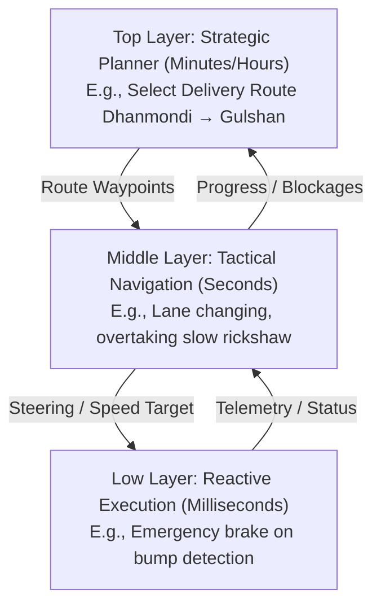

---

### Chapter 1 Quick Check

<details>
<summary><b>🔍 Self-Check Question 1:</b> What is the difference between an Agent Function and an Agent Program?</summary>

- **Agent Function:** The mathematical abstraction that maps any given percept sequence history to an action ($f: P^* \rightarrow A$).
- **Agent Program:** The concrete software implementation of the agent function running on physical computing architecture.
</details>

<details>
<summary><b>🔍 Self-Check Question 2:</b> Why is an environment classified as dynamic rather than static?</summary>

An environment is **dynamic** if it can change while the agent is deliberating. If the environment does not change with the passage of time during decision-making, it is **static**.
</details>

---

## Chapter 02 — Uninformed Search

> **In One Line:** Blind search algorithms systematically explore state spaces using only state connectivity and transition costs, possessing zero domain-specific knowledge about goal proximity.

### 2.1 Search Graph Formulation

A formal search problem is defined by a 5-tuple:
1. **Initial State ($s_0$):** Starting node.
2. **Actions ($A(s)$):** Legal moves available in state $s$.
3. **Transition Model ($Result(s, a)$):** The state resulting from action $a$ in $s$.
4. **Goal Test ($IsGoal(s)$):** Boolean predicate determining if state is a target.
5. **Path Cost ($c(s, a, s')$):** Step cost $g(n)$ accumulated along the path.

#### Benchmark Graph for Traces

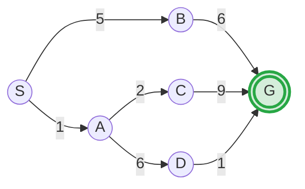

**Alternative Paths & Costs:**
- $S \rightarrow B \rightarrow G$: Cost $= 5 + 6 = 11$
- $S \rightarrow A \rightarrow C \rightarrow G$: Cost $= 1 + 2 + 9 = 12$
- $S \rightarrow A \rightarrow D \rightarrow G$: Cost $= 1 + 6 + 1 = \mathbf{8}$ *(Optimal)*

---

### 2.2 Breadth-First Search (BFS)

- **Mechanism:** Explores shallowest unexplored nodes first using a **FIFO Queue**.
- **Goal Test Timing:** Applied when node is **generated**.
- **Properties:** Complete (if branching factor $b$ is finite). Optimal if and only if all step costs are identical.
- **Time Complexity:** $O(b^d)$, **Space Complexity:** $O(b^d)$ (where $d$ is goal depth).

#### Manual Trace on Benchmark Graph

| Step | Expand Node | Frontier FIFO Queue | Notes |
| :---: | :---: | :--- | :--- |
| **1** | $S$ | $[A, B]$ | $S$ expanded; $A, B$ added |
| **2** | $A$ | $[B, C, D]$ | $A$ expanded; $C, D$ added |
| **3** | $B$ | $[C, D, G]$ | **Goal $G$ generated!** Immediate termination |

- **Output Path:** $S \rightarrow B \rightarrow G$ (2 hops, Path Cost $= 11$). Found minimum hops, not minimal cost!

---

### 2.3 Depth-First Search (DFS)

- **Mechanism:** Explores deepest nodes first using a **LIFO Stack** (or recursion).
- **Goal Test Timing:** Applied when node is expanded.
- **Properties:** Not complete in infinite/cyclic state spaces (complete on finite spaces with graph cycle checking). Not optimal.
- **Time Complexity:** $O(b^m)$, **Space Complexity:** $O(b \cdot m)$ (where $m$ is maximum tree depth).

#### Manual Trace (Alphabetical Tie-Breaking)
1. Expand $S \rightarrow$ Stack: $[B, A]$
2. Expand $A \rightarrow$ Stack: $[B, D, C]$
3. Expand $C \rightarrow$ Stack: $[B, D, G]$
4. Expand $G \rightarrow$ **Goal reached!**
- **Output Path:** $S \rightarrow A \rightarrow C \rightarrow G$ (Cost $= 12$).

---

### 2.4 Uniform Cost Search (UCS)

- **Mechanism:** Expands node with the lowest cumulative path cost $g(n)$ using a **Priority Queue (Min-Heap)**. (Dijkstra's search formulation).
- **Goal Test Timing:** Applied when node is **expanded / popped**, NOT when generated!
- **Properties:** Complete (if step costs $\ge \epsilon > 0$). **Optimal** for arbitrary non-negative step costs.
- **Complexity:** Time & Space $O(b^{1 + \lfloor C^* / \epsilon \rfloor})$, where $C^*$ is optimal cost.

#### Manual Step-by-Step Trace

| Step | Node Popped | $g(n)$ | Frontier Priority Queue $\{Node: g(n)\}$ | Explored Set |
| :---: | :---: | :---: | :--- | :--- |
| **1** | $S$ | $0$ | $\{A: 1, B: 5\}$ | $\{S\}$ |
| **2** | $A$ | $1$ | $\{C: 3, B: 5, D: 7\}$ | $\{S, A\}$ |
| **3** | $C$ | $3$ | $\{B: 5, D: 7, G: 12\}$ | $\{S, A, C\}$ |
| **4** | $B$ | $5$ | $\{D: 7, G: 11\}$ *(G updated: $\min(12, 11) = 11$)* | $\{S, A, C, B\}$ |
| **5** | $D$ | $7$ | $\{G: 8\}$ *(G updated: $\min(11, 7+1) = 8$)* | $\{S, A, C, B, D\}$ |
| **6** | $G$ | $\mathbf{8}$ | Goal popped! **Terminate.** | $\{S, A, C, B, D, G\}$ |

- **Output Path:** $S \rightarrow A \rightarrow D \rightarrow G$ (Optimal Cost $= \mathbf{8}$).

---

### 2.5 Depth-Limited (DLS) & Iterative Deepening (IDS)

#### Depth-Limited Search (DLS)
DFS executed with a fixed depth bound $l$. Returns cutoff if depth limit is reached without finding goal.
- Space Complexity: $O(b \cdot l)$. Incomplete if $l < d$.

#### Iterative Deepening Search (IDS)
Repeatedly invokes DLS with incrementally increasing depth limits: $l = 0, 1, 2, \dots, d$.

```
Iteration l=0: [S] (Cutoff)
Iteration l=1: [S -> A], [S -> B] (Cutoff)
Iteration l=2: [S -> A -> C], [S -> A -> D], [S -> B -> G] (Goal Found!)
```

> [!TIP]
> **Why IDS is not wasteful:**
> In exponential search trees, the vast majority of nodes reside at the bottom layer ($d$).
> Total nodes generated in IDS:
> $$N(\text{IDS}) = (d+1)b^0 + d b^1 + (d-1)b^2 + \dots + 1 b^d = O(b^d)$$
> For $b=10, d=5$: BFS generates $111,110$ nodes; IDS generates $123,450$ nodes (only $\approx 11\%$ overhead), while saving massive amounts of RAM: $O(b \cdot d)$ vs $O(b^d)$!

---

### 2.6 Bidirectional Search

Runs two concurrent searches: **Forward** from Initial State and **Backward** from Goal State, terminating when frontiers intersect.

```mermaid
graph LR
    subgraph Forward [Forward Frontier O(b^{d/2})]
        S((Start)) --> F1(( )) --> F2((Intersection))
    end
    subgraph Backward [Backward Frontier O(b^{d/2})]
        F2 --> B1(( )) --> G(((Goal)))
    end
```

$$b^{d/2} + b^{d/2} \ll b^d$$

---

### 2.7 Python Reference: Uninformed Search Algorithms

```python
import heapq
from collections import deque

graph = {
    'S': [('A', 1), ('B', 5)],
    'A': [('C', 2), ('D', 6)],
    'B': [('G', 6)],
    'C': [('G', 9)],
    'D': [('G', 1)],
    'G': []
}

def bfs(start, goal):
    queue = deque([[start]])
    visited = set()
    while queue:
        path = queue.popleft()
        node = path[-1]
        if node == goal:
            return path
        if node not in visited:
            visited.add(node)
            for neighbor, _ in graph.get(node, []):
                queue.append(path + [neighbor])
    return None

def ucs(start, goal):
    # Min-heap stores: (cost, current_node, path)
    heap = [(0, start, [start])]
    visited = {}
    while heap:
        cost, node, path = heapq.heappop(heap)
        if node == goal:
            return path, cost
        if node in visited and visited[node] <= cost:
            continue
        visited[node] = cost
        for neighbor, weight in graph.get(node, []):
            heapq.heappush(heap, (cost + weight, neighbor, path + [neighbor]))
    return None, float('inf')

print("BFS Path:", bfs('S', 'G'))          # Output: ['S', 'B', 'G']
print("UCS Path & Cost:", ucs('S', 'G'))   # Output: (['S', 'A', 'D', 'G'], 8)
```

---

### Chapter 2 Quick Check

<details>
<summary><b>🔍 Self-Check Question 1:</b> When must the goal test be applied in Uniform Cost Search (UCS) to guarantee optimality?</summary>

The goal test must be applied when a node is **expanded (popped from priority queue)**, not when generated. Testing upon generation can return suboptimal paths before cheaper alternatives are discovered.
</details>

<details>
<summary><b>🔍 Self-Check Question 2:</b> What search algorithm combines the low space complexity of DFS with the completeness/optimality of BFS?</summary>

**Iterative Deepening Search (IDS)** achieves $O(b \cdot d)$ linear memory with $O(b^d)$ time and guaranteed optimality for uniform step costs.
</details>

---

## Chapter 03 — Informed (Heuristic) Search

> **In One Line:** Informed search utilizes domain-specific heuristics ($h(n)$) to prioritize nodes that appear closest to the goal, drastically pruning the state space.

### 3.1 Heuristic Functions, Admissibility & Consistency

- **Heuristic Function $h(n)$:** Estimated path cost from node $n$ to the nearest goal state ($h(Goal) = 0$).
- **True Remaining Cost $h^*(n)$:** The exact, optimal cost from node $n$ to goal.

```
                      ┌── Admissible: 0 ≤ h(n) ≤ h*(n) [Never overestimates]
Heuristic Properties ─┤
                      └── Consistent (Monotone): h(n) ≤ c(n, a, n') + h(n') [Triangle inequality]
```

> [!IMPORTANT]
> **Admissibility vs Consistency:**
> - **Admissibility:** $h(n) \le h^*(n)$ for all $n$. Guarantees **Tree Search A\*** is optimal.
> - **Consistency (Monotonicity):** $h(n) \le c(n, n') + h(n')$. Guarantees **Graph Search A\*** is optimal without needing to re-open nodes in the closed set.
> - *Every consistent heuristic is admissible.*

#### Dominance
If $h_2(n) \ge h_1(n)$ for all $n$ and both are admissible, $h_2$ **dominates** $h_1$. A\* using $h_2$ will expand fewer or equal nodes compared to $h_1$. (e.g., Manhattan Distance dominates Misplaced Tiles in 8-Puzzle).

#### Benchmark Heuristic Table for Graph

| Node | $S$ | $A$ | $B$ | $C$ | $D$ | $G$ |
| :---: | :---: | :---: | :---: | :---: | :---: | :---: |
| **Heuristic $h(n)$** | $7$ | $6$ | $5$ | $7$ | $1$ | $0$ |
| **True Cost to Goal $h^*(n)$** | $8$ | $7$ | $6$ | $9$ | $1$ | $0$ |

*(All $h(n) \le h^*(n)$, making $h$ admissible & consistent).*

---

### 3.2 Greedy Best-First Search

- **Evaluation Function:** $f(n) = h(n)$ (pure heuristic focus, ignores past path cost $g(n)$).
- **Characteristics:** Fast and goal-directed, but incomplete (can loop in cycles) and **suboptimal**.

#### Trace on Benchmark Graph
1. Expand $S \rightarrow$ Frontier: $\{B: h=5, A: h=6\}$
2. Expand $B \rightarrow$ Frontier: $\{G: h=0, A: h=6\}$
3. Expand $G \rightarrow$ **Goal reached!**
- **Output Path:** $S \rightarrow B \rightarrow G$ (Path Cost $= \mathbf{11}$). Misled by greedily choosing $B$ over $A$.

---

### 3.3 A\* Search

- **Evaluation Function:** $f(n) = g(n) + h(n)$
  - $g(n)$: Exact accumulated cost from start to $n$.
  - $h(n)$: Estimated cost from $n$ to goal.
  - $f(n)$: Estimated total cost of optimal path through $n$.

#### Step-by-Step Manual Trace

| Step | Node Expanded | $g(n)$ | $h(n)$ | $f(n)$ | New Successors Generated ($g + h = f$) | Priority Queue Sorted by $f(n)$ |
| :---: | :---: | :---: | :---: | :---: | :--- | :--- |
| **1** | $S$ | $0$ | $7$ | $7$ | $A(1+6=7), B(5+5=10)$ | $\{A: 7, B: 10\}$ |
| **2** | $A$ | $1$ | $6$ | $7$ | $C(3+7=10), D(7+1=8)$ | $\{D: 8, B: 10, C: 10\}$ |
| **3** | $D$ | $7$ | $1$ | $8$ | $G(8+0=8)$ | $\{G: 8, B: 10, C: 10\}$ |
| **4** | $G$ | $8$ | $0$ | $\mathbf{8}$ | Goal Popped! **Terminate.** | — |

- **Output Path:** $S \rightarrow A \rightarrow D \rightarrow G$ (Optimal Cost $= \mathbf{8}$).
- **Comparison:** UCS expanded 5 nodes before reaching $G$; A\* expanded only 3!

---

### 3.4 IDA\* (Iterative Deepening A\*)

- **Problem with A\*:** A\* keeps all generated nodes in memory ($O(b^d)$ space bottleneck).
- **IDA\* Solution:** Performs depth-first search bounded by an **$f$-cost threshold** instead of depth.
- **Update Rule:** If goal not found, threshold is increased to the **minimum $f$-value that exceeded the previous limit**.
- **Space Complexity:** $O(b \cdot d)$ (linear memory!).

---

### 3.5 Python Reference: A\* Search Engine

```python
import heapq

graph = {
    'S': [('A', 1), ('B', 5)],
    'A': [('C', 2), ('D', 6)],
    'B': [('G', 6)],
    'C': [('G', 9)],
    'D': [('G', 1)],
    'G': []
}

heuristics = {'S': 7, 'A': 6, 'B': 5, 'C': 7, 'D': 1, 'G': 0}

def a_star_search(start, goal):
    # Heap stores: (f_cost, g_cost, current_node, path)
    frontier = [(heuristics[start], 0, start, [start])]
    explored = {}

    while frontier:
        f, g, node, path = heapq.heappop(frontier)

        if node == goal:
            return path, g

        if node in explored and explored[node] <= g:
            continue
        explored[node] = g

        for neighbor, weight in graph.get(node, []):
            new_g = g + weight
            new_f = new_g + heuristics[neighbor]
            heapq.heappush(frontier, (new_f, new_g, neighbor, path + [neighbor]))

    return None, float('inf')

path, cost = a_star_search('S', 'G')
print(f"A* Optimal Path: {path} with Total Cost: {cost}")
# Output: A* Optimal Path: ['S', 'A', 'D', 'G'] with Total Cost: 8
```

---

### Chapter 3 Quick Check

<details>
<summary><b>🔍 Self-Check Question 1:</b> If heuristic h(n) = 0 for all states, what standard algorithm does A* become?</summary>

When $h(n) = 0$, $f(n) = g(n) + 0 = g(n)$, reducing A\* identically to **Uniform Cost Search (UCS)**.
</details>

<details>
<summary><b>🔍 Self-Check Question 2:</b> Can an admissible heuristic overestimate the true cost to the goal?</summary>

**No.** By definition, an admissible heuristic must satisfy $0 \le h(n) \le h^*(n)$ for all nodes $n$. Overestimating could cause A\* to bypass the true optimal path.
</details>

---

## Chapter 04 — Metaheuristic Algorithms

> **In One Line:** When search spaces are astronomically large, metaheuristics iteratively optimize candidate solutions on a fitness landscape to find high-quality solutions rapidly.

### 4.1 Hill Climbing & Landscape Hazards

Hill climbing begins with an arbitrary state and iteratively shifts towards the neighbor with the highest objective improvement.

```
       Global Maximum
           ▲
          / \        Local Maximum
         /   \           ▲
        /     \         / \       Shoulder
       /       \       /   \___  ________
      /         \_____/        \/
                 Plateau
```

#### Landscape Pathologies

| Hazard | Landscape Characterization | Failure Mode / Consequence | Remedial Strategy |
| :--- | :--- | :--- | :--- |
| **Local Maximum** | Peak higher than immediate neighbors, but suboptimal globally | Algorithm halts prematurely at suboptimal peak | Random Restarts, Simulated Annealing |
| **Plateau** | Flat state space region with identical evaluation values | Gradients vanish ($\nabla f = 0$); random walk | Allow bounded sideways moves |
| **Ridge** | Narrow sequence of local maxima leading upward | Slopes drop in all orthogonal cardinal directions | Macro-moves, diagonal step variations |

---

### 4.2 Hill Climbing Variations

- **Steepest-Ascent:** Evaluates all neighbors; transitions to highest scoring neighbor.
- **Stochastic Hill Climbing:** Chooses randomly among uphill neighbors, weighted by gradient magnitude.
- **First-Choice Hill Climbing:** Generates random neighbors sequentially, selecting the first one that improves fitness.
- **Random-Restart Hill Climbing:** Runs $k$ independent hill-climb trials from randomized initial states:
  $$\text{Success Probability} = 1 - (1 - p)^k$$

---

### 4.3 Simulated Annealing

Simulated Annealing mimics the metallurgical cooling process, permitting downhill/worse moves with a temperature-dependent probability to escape local optima.

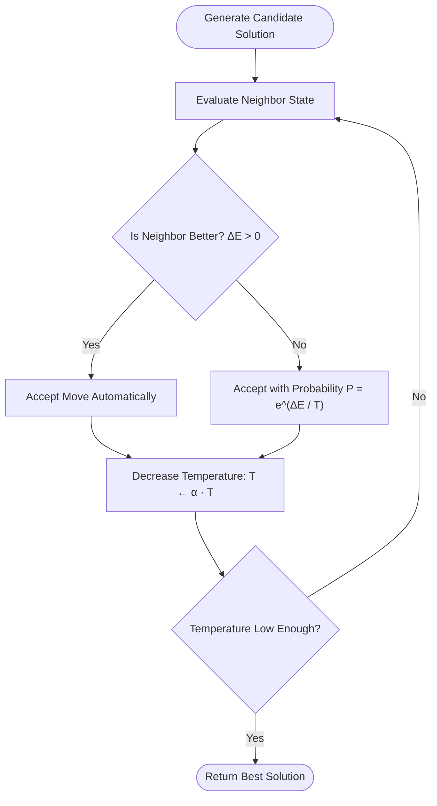

#### Acceptance Probability Formula
$$\Delta E = E_{\text{new}} - E_{\text{current}} \quad (\text{For maximization, } \Delta E < 0 \text{ is worse})$$
$$P(\text{accept}) = e^{\frac{\Delta E}{T}}$$

- At high Temperature $T \gg 0$: $P(\text{accept}) \approx 1$ (Aggressive exploration).
- At low Temperature $T \rightarrow 0$: $P(\text{accept}) \approx 0$ (Pure hill climbing exploitation).

---

### 4.4 Genetic Algorithms (GA)

Genetic Algorithms simulate Darwinian natural selection across a population of candidate chromosome bit-strings.

```
[Population] ──► [Fitness Evaluation] ──► [Roulette Selection] ──► [Crossover] ──► [Mutation] ──► [New Generation]
```

#### Comprehensive Worked Example: Maximizing $f(x) = x^2$ for $x \in [0, 31]$ (5-bit String)

1. **Initial Population & Selection Probabilities ($P_i = \frac{f_i}{\sum f}$):**

| Chromosome | $x$ | Fitness $f(x) = x^2$ | $P_i$ (Selection Probability) |
| :---: | :---: | :---: | :---: |
| $C_1: 01101$ | $13$ | $169$ | $169 / 1170 \approx \mathbf{14.4\%}$ |
| $C_2: 11000$ | $24$ | $576$ | $576 / 1170 \approx \mathbf{49.2\%}$ |
| $C_3: 01000$ | $8$ | $64$ | $64 / 1170 \approx \mathbf{5.5\%}$ |
| $C_4: 10011$ | $19$ | $361$ | $361 / 1170 \approx \mathbf{30.9\%}$ |
| **Sum ($\sum$)** | — | $\mathbf{1170}$ | **$100\%$** |

2. **Single-Point Crossover (Cut-point = 4 between Parent $C_1$ and Parent $C_2$):**
   - Parent 1: `0 1 1 0 | 1` $\rightarrow$ **Child 1:** `0 1 1 0 | 0` ($x=12, f=144$)
   - Parent 2: `1 1 0 0 | 0` $\rightarrow$ **Child 2:** `1 1 0 0 | 1` ($x=25, f=\mathbf{625}$)
3. **Mutation:** Bit 3 flipped on Child 2: `1 1 0 1 1` ($x=27, f=\mathbf{729}$).

---

### 4.5 Differential Evolution (DE)

Population-based global optimization algorithm tailored for **continuous vector spaces** $\mathbf{x} \in \mathbb{R}^D$.

$$\mathbf{v}_i = \mathbf{x}_{r_1} + F \cdot (\mathbf{x}_{r_2} - \mathbf{x}_{r_3})$$

- $\mathbf{v}_i$: Mutant donor vector.
- $F \in [0, 2]$: Mutation scaling factor.
- $r_1, r_2, r_3$: Distinct randomly chosen vector indices.

---

### 4.6 Gradient Descent

Iterative first-order optimization algorithm to minimize differentiable objective loss functions $J(\theta)$.

$$\theta^{(t+1)} = \theta^{(t)} - \alpha \nabla_{\theta} J(\theta)$$

```python
# Minimizing J(θ) = θ^2 -> Gradient dJ/dθ = 2θ
theta = 4.0
alpha = 0.1  # Learning rate
for step in range(5):
    grad = 2 * theta
    theta = theta - alpha * grad
    print(f"Step {step+1}: theta = {theta:.4f}, Loss = {theta**2:.4f}")
```

---

### 4.7 Python Reference: Optimization in Action

```python
import math
import random

def simulated_annealing(cost_func, initial_state, temp=1000.0, cooling_rate=0.95, min_temp=1e-3):
    current_state = initial_state
    current_cost = cost_func(current_state)
    best_state, best_cost = current_state, current_cost

    while temp > min_temp:
        # Neighbor: perturb current state slightly
        neighbor = current_state + random.uniform(-1.0, 1.0)
        neighbor_cost = cost_func(neighbor)
        delta_e = neighbor_cost - current_cost

        # For minimization: accept if better or probabilistically if worse
        if delta_e < 0 or random.random() < math.exp(-delta_e / temp):
            current_state = neighbor
            current_cost = neighbor_cost
            if current_cost < best_cost:
                best_state, best_cost = current_state, current_cost

        temp *= cooling_rate

    return best_state, best_cost

# Target: Minimize f(x) = (x - 7)^2 + 3 -> Optimal x = 7.0, f(x) = 3.0
opt_x, min_val = simulated_annealing(lambda x: (x - 7)**2 + 3, initial_state=0.0)
print(f"Optimized x: {opt_x:.2f}, Minimum Value: {min_val:.2f}")
```

---

### Chapter 4 Quick Check

<details>
<summary><b>🔍 Self-Check Question 1:</b> In Simulated Annealing, what happens to the acceptance probability of a bad move as temperature T approaches 0?</summary>

As $T \rightarrow 0$, $e^{\Delta E / T} \rightarrow 0$ (for $\Delta E < 0$). The probability of accepting worse moves vanishes, causing the algorithm to behave purely as deterministic greedy hill climbing.
</details>

---

## Chapter 05 — Adversarial Search & Games

> **In One Line:** Adversarial search models competitive multi-agent environments where agents must select optimal moves under the assumption of a rational, counter-maximizing opponent.

### 5.1 Game Formulations & Game Trees

A deterministic, two-player, zero-sum game is formalized as:
- **$S_0$:** Initial state configuration.
- **$\text{Player}(s)$:** Returns whose turn it is ($\text{MAX}$ or $\text{MIN}$).
- **$\text{Actions}(s)$:** Legal move set.
- **$\text{Result}(s, a)$:** State transition resulting from move $a$.
- **$\text{Terminal-Test}(s)$:** True if game has finished.
- **$\text{Utility}(s, p)$:** Numeric outcome payoff for player $p$ at terminal state $s$ (e.g., $+1, 0, -1$).

---

### 5.2 The Minimax Algorithm

$$\text{Minimax}(s) = \begin{cases} \text{Utility}(s) & \text{if Terminal-Test}(s) \\ \max_{a \in A(s)} \text{Minimax}(\text{Result}(s, a)) & \text{if Player}(s) = \text{MAX} \\ \min_{a \in A(s)} \text{Minimax}(\text{Result}(s, a)) & \text{if Player}(s) = \text{MIN} \end{cases}$$

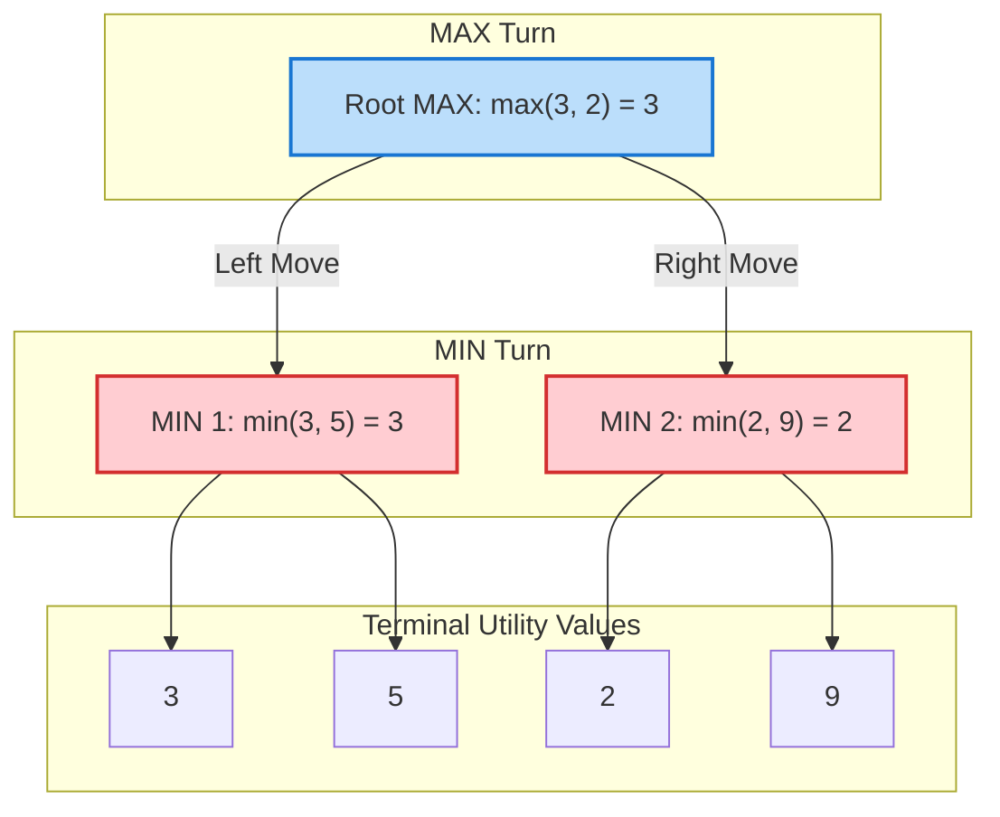

> [!WARNING]
> **Common Student Exam Trap:**
> Do NOT simply look for the highest leaf in the tree (e.g., $9$). If MAX chooses the right branch hoping for $9$, a rational MIN opponent will choose $2$, giving MAX a payoff of $2$. MAX must play Left to secure guaranteed utility $\mathbf{3}$.

---

### 5.3 Alpha-Beta Pruning ($\alpha$-$\beta$)

$\alpha$-$\beta$ pruning returns the exact identical minimax decision while avoiding expansion of subtrees that cannot influence the final root outcome.

- $\alpha$: Value of the best (highest-value) choice found so far along the path for **MAX** ($\text{Initial } \alpha = -\infty$).
- $\beta$: Value of the best (lowest-value) choice found so far along the path for **MIN** ($\text{Initial } \beta = +\infty$).
- **Pruning Invariant:** Prune subtree branches beneath a node as soon as $\alpha \ge \beta$.

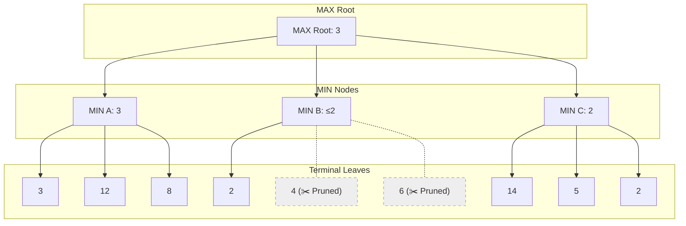

#### Step-by-Step Trace of Pruning

1. Left MIN evaluates leaves $3, 12, 8 \rightarrow \text{Returns } 3$.
2. Root MAX updates its lower bound: $\alpha = \max(-\infty, 3) = \mathbf{3}$.
3. Middle MIN inspects first child ($2$). Its bound becomes $\beta = \min(+\infty, 2) = \mathbf{2}$.
4. **Pruning Condition Checked:** $\alpha (3) \ge \beta (2) \implies$ **Cutoff occurs!** Remaining children $4$ and $6$ are discarded without evaluation.
5. Right MIN evaluates $14, 5, 2 \rightarrow \text{Returns } 2$. Root $\alpha = \max(3, 2) = \mathbf{3}$.

---

### 5.4 Python Reference: Minimax & Alpha-Beta Engine

```python
def alpha_beta(node, depth, alpha, beta, is_maximizing, tree):
    # Base case: terminal leaf node
    if isinstance(tree[node], int):
        return tree[node]

    if is_maximizing:
        max_eval = float('-inf')
        for child in tree[node]:
            eval_score = alpha_beta(child, depth - 1, alpha, beta, False, tree)
            max_eval = max(max_eval, eval_score)
            alpha = max(alpha, eval_score)
            if alpha >= beta:
                break  # Beta cutoff / prune
        return max_eval
    else:
        min_eval = float('inf')
        for child in tree[node]:
            eval_score = alpha_beta(child, depth - 1, alpha, beta, True, tree)
            min_eval = min(min_eval, eval_score)
            beta = min(beta, eval_score)
            if alpha >= beta:
                break  # Alpha cutoff / prune
        return min_eval

game_tree = {
    'Root': ['M1', 'M2', 'M3'],
    'M1': ['L1', 'L2', 'L3'],
    'M2': ['L4', 'L5', 'L6'],
    'M3': ['L7', 'L8', 'L9'],
    'L1': 3, 'L2': 12, 'L3': 8,
    'L4': 2, 'L5': 4,  'L6': 6,
    'L7': 14, 'L8': 5, 'L9': 2
}

optimal_score = alpha_beta('Root', 2, float('-inf'), float('inf'), True, game_tree)
print(f"Optimal Alpha-Beta Minimax Value: {optimal_score}") # Output: 3
```

---

### Chapter 5 Quick Check

<details>
<summary><b>🔍 Self-Check Question 1:</b> In the best-case move ordering, what is the effective time complexity of Alpha-Beta pruning?</summary>

Under perfect move ordering (best moves evaluated first), the branching factor is effectively halved: $O(b^{m/2})$. This allows alpha-beta to search twice as deep as standard Minimax in identical compute time.
</details>

---

## Chapter 06 — Constraint Satisfaction Problems (CSPs)

> **In One Line:** CSPs reframe problem-solving from arbitrary path search to finding consistent variable assignments that adhere to an explicit set of constraints.

### 6.1 CSP Formalism & Constraint Graphs

A CSP comprises:
1. **Variables ($X$):** $X = \{X_1, X_2, \dots, X_n\}$
2. **Domains ($D$):** $D = \{D_1, D_2, \dots, D_n\}$, where $D_i$ denotes legal values for $X_i$.
3. **Constraints ($C$):** $C = \{C_1, C_2, \dots, C_m\}$, specifying allowed combinations of values.

#### Map Coloring Problem (Australia)

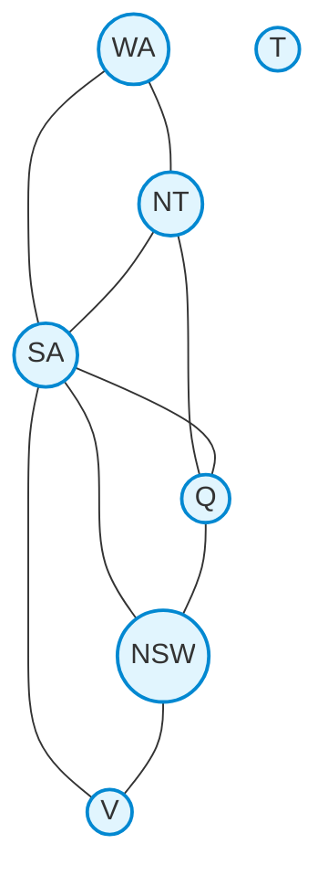

- **Variables:** $\{WA, NT, SA, Q, NSW, V, T\}$
- **Domain:** $\{\text{Red}, \text{Green}, \text{Blue}\}$
- **Constraints:** Adjacent regions must not share identical colors ($WA \ne NT, WA \ne SA, \dots$).
- **Valid Solution:** $\{WA=R, NT=G, SA=B, Q=R, NSW=G, V=R, T=R\}$.

---

### 6.2 Constraint Propagation: Forward Checking & AC-3

#### Forward Checking
Whenever variable $X$ is assigned, prune all values from the domains of unassigned neighbors $Y$ that violate constraints with $X$. Backtrack immediately if any domain becomes empty.

#### Arc Consistency (AC-3 Algorithm)
An arc $X_i \rightarrow X_j$ is **arc-consistent** if for *every* value $x \in D_i$, there exists *some* legal value $y \in D_j$ satisfying binary constraint $(X_i, X_j)$.

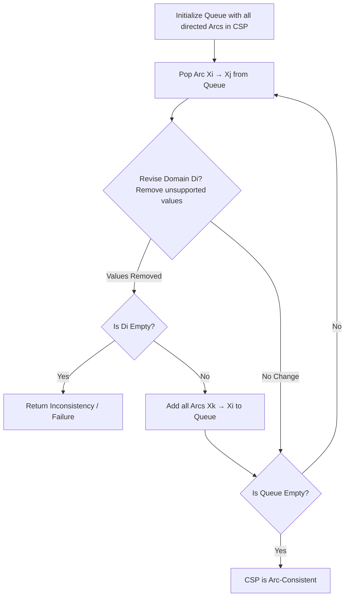

---

### 6.3 Backtracking Search with MRV, Degree & LCV

Standard CSP Backtracking is a recursive depth-first search assigning one variable at a time. Three core heuristics accelerate search performance:

```
Variable Ordering Heuristics ──┬── Minimum Remaining Values (MRV): "Fail-First" (Fewest legal values left)
                               └── Degree Heuristic: Tie-breaker (Variable connected to most unassigned neighbors)

Value Ordering Heuristics    ──── Least Constraining Value (LCV): "Fail-Last" (Prunes fewest options from neighbors)
```

| Heuristic | Question Answered | Operational Rule | Intuitive Rationale |
| :--- | :--- | :--- | :--- |
| **MRV** | Which variable next? | Select variable with smallest $|D_i|$ | Identifies failures immediately at top of search tree |
| **Degree** | Which variable next (tie)? | Select variable involved in maximum active constraints | Constrains other variables maximally |
| **LCV** | Which value to try first? | Select value that rules out fewest neighbor values | Leaves maximum flexibility for remaining assignments |

---

### 6.4 Python Reference: CSP Solver

```python
def is_valid(assignment, var, val, neighbors):
    for neighbor in neighbors.get(var, []):
        if neighbor in assignment and assignment[neighbor] == val:
            return False
    return True

def backtrack(assignment, variables, domains, neighbors):
    if len(assignment) == len(variables):
        return assignment  # Solution found

    # Minimum Remaining Values (MRV)
    unassigned = [v for v in variables if v not in assignment]
    var = min(unassigned, key=lambda v: len(domains[v]))

    for val in domains[var]:
        if is_valid(assignment, var, val, neighbors):
            assignment[var] = val
            result = backtrack(assignment, variables, domains, neighbors)
            if result is not None:
                return result
            del assignment[var]  # Backtrack

    return None

vars_australia = ['WA', 'NT', 'SA', 'Q', 'NSW', 'V', 'T']
doms = {v: ['Red', 'Green', 'Blue'] for v in vars_australia}
adj = {
    'WA': ['NT', 'SA'], 'NT': ['WA', 'SA', 'Q'],
    'SA': ['WA', 'NT', 'Q', 'NSW', 'V'], 'Q': ['NT', 'SA', 'NSW'],
    'NSW': ['SA', 'Q', 'V'], 'V': ['SA', 'NSW'], 'T': []
}

solution = backtrack({}, vars_australia, doms, adj)
print("CSP Map Coloring Assignment:", solution)
```

---

### Chapter 6 Quick Check

<details>
<summary><b>🔍 Self-Check Question 1:</b> What is the time complexity of the AC-3 arc consistency algorithm for a CSP with n variables, domain size at most d, and c binary constraints?</summary>

AC-3 has a worst-case time complexity of $O(c \cdot d^3)$ operations.
</details>

---

## Chapter 07 — Learning in AI & Neural Networks

> **In One Line:** Machine Learning empowers systems to extract predictive mappings from data, using neural networks and gradient backpropagation to model non-linear boundaries.

### 7.1 Foundations of Machine Learning

$$\text{Traditional: } \text{Data} + \text{Rules} \rightarrow \text{Answers} \qquad\Longleftrightarrow\qquad \text{Machine Learning: } \text{Data} + \text{Answers} \rightarrow \text{Rules (Model)}$$

- **Supervised Learning:** Inputs paired with target labels (Classification / Regression).
- **Unsupervised Learning:** Unlabeled data; clusters patterns (K-Means, PCA).
- **Reinforcement Learning:** Learns through scalar reward feedback from environment.

```
Underfitting (High Bias) ◄────── Balanced (Generalization) ──────► Overfitting (High Variance)
 [Model is too simple]             [Captures true signal]            [Memorizes noise]
```

---

### 7.2 Artificial Neural Networks & Activation Functions

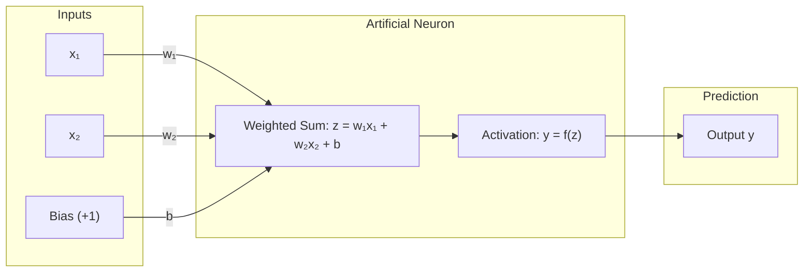

$$z = \sum_{i=1}^{n} w_i x_i + b \qquad\Longrightarrow\qquad y = \sigma(z) = \frac{1}{1 + e^{-z}}$$

#### Standard Activation Functions

| Function | Mathematical Formulation | Output Range | Primary Application |
| :--- | :--- | :--- | :--- |
| **Sigmoid ($\sigma$)** | $f(z) = \frac{1}{1 + e^{-z}}$ | $(0, 1)$ | Binary probabilities / Output layers |
| **Tanh** | $f(z) = \frac{e^z - e^{-z}}{e^z + e^{-z}}$ | $(-1, +1)$ | Zero-centered hidden layer activations |
| **ReLU** | $f(z) = \max(0, z)$ | $[0, \infty)$ | Default hidden layer activation (prevents vanishing gradient) |
| **Softmax** | $f(z_i) = \frac{e^{z_i}}{\sum_j e^{z_j}}$ | $(0, 1), \sum=1$ | Multi-class categorical distributions |

---

### 7.3 The Backpropagation Algorithm

Backpropagation implements the multivariate calculus **chain rule** to propagate loss gradients backwards from the output layer to hidden weights.

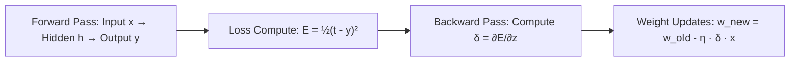

#### Detailed Single Neuron Calculation Walkthrough

- **Given Parameters:** Inputs $x_1 = 1.0, x_2 = 0.5$; Initial weights $w_1 = 0.4, w_2 = 0.6$; Bias $b = 0.1$; Learning rate $\eta = 0.5$; Target label $t = 1.0$.

1. **Forward Pass:**
   $$z = w_1 x_1 + w_2 x_2 + b = (0.4)(1.0) + (0.6)(0.5) + 0.1 = 0.4 + 0.3 + 0.1 = \mathbf{0.8}$$
   $$y = \sigma(0.8) = \frac{1}{1 + e^{-0.8}} = \frac{1}{1 + 0.4493} = \mathbf{0.69}$$
   $$\text{Error } E = \frac{1}{2}(t - y)^2 = \frac{1}{2}(1.0 - 0.69)^2 = \mathbf{0.048}$$

2. **Backward Pass (Gradient Computation):**
   $$\delta = (y - t) \cdot y(1 - y) = (0.69 - 1.0) \cdot (0.69)(0.31) = (-0.31)(0.2139) = \mathbf{-0.0663}$$

3. **Weight Adjustments ($w_i \leftarrow w_i - \eta \cdot \delta \cdot x_i$):**
   $$w_1^{\text{new}} = 0.4 - (0.5)(-0.0663)(1.0) = 0.4 + 0.0331 = \mathbf{0.4331}$$
   $$w_2^{\text{new}} = 0.6 - (0.5)(-0.0663)(0.5) = 0.6 + 0.0166 = \mathbf{0.6166}$$
   $$b^{\text{new}} = 0.1 - (0.5)(-0.0663) = 0.1 + 0.0331 = \mathbf{0.1331}$$

---

### 7.4 Python Reference: Neural Network Forward & Backprop Pass

```python
import numpy as np

def sigmoid(z):
    return 1.0 / (1.0 + np.exp(-z))

def sigmoid_derivative(y):
    return y * (1.0 - y)

# Sample Forward & Backpropagation Step
x = np.array([1.0, 0.5])
w = np.array([0.4, 0.6])
b = 0.1
target = 1.0
eta = 0.5

# 1. Forward
z = np.dot(w, x) + b
y = sigmoid(z)
error = 0.5 * (target - y)**2

# 2. Backward
delta = (y - target) * sigmoid_derivative(y)
grad_w = delta * x
grad_b = delta

# 3. Update
w_new = w - eta * grad_w
b_new = b - eta * grad_b

print(f"Output y: {y:.4f} | Loss: {error:.4f}")
print(f"Updated Weights: {w_new.round(4)} | Updated Bias: {b_new:.4f}")
```

---

## Chapter 08 — Knowledge Bases & Logic

> **In One Line:** Knowledge-based agents store structured logical assertions and use sound inference procedures (forward/backward chaining) to prove conclusions and diagnose faults.

### 8.1 Propositional Logic & Models

- **Knowledge Base ($KB$):** A set of sentences expressed in formal logic.
- **Entailment ($KB \models \alpha$):** Sentence $\alpha$ is true in *all* possible worlds/models where $KB$ is true.
- **Inference Rule (Modus Ponens):** From $P$ and $P \rightarrow Q$, infer $Q$.

---

### 8.2 Definite Clauses & Horn Clauses

A **definite clause** contains exactly one positive literal (its head) and conjunctions of positive body atoms:

$$h \leftarrow a_1 \land a_2 \land \dots \land a_m$$

*(Read as: $h$ is true IF $a_1 \land \dots \land a_m$ are all true).*

```
light_on   ← switch_up ∧ power_ok.
power_ok   ← breaker_ok.
breaker_ok.
switch_up.
```

---

### 8.3 Proof Procedures: Forward & Backward Chaining

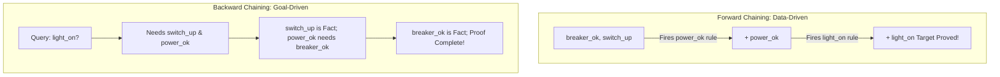

| Attribute | Bottom-Up (Forward Chaining) | Top-Down (Backward Chaining) |
| :--- | :--- | :--- |
| **Direction** | Data-driven: Facts $\rightarrow$ Conclusions | Goal-driven: Query $\rightarrow$ Supporting Subgoals |
| **Use Case** | Routine monitoring, reactive production systems | Query answering, expert diagnostics, Prolog engines |
| **Space Overhead** | High (derives all possible consequences) | Low (explores only goal-relevant sub-branches) |

---

### 8.4 Ask-the-User & Knowledge-Level Debugging

- **Askable Atoms:** Primitives that can be queried from the user at runtime during backward chaining.
- **Debugging Types:**
  - **Incorrect Answer:** Trace backward to find a clause where body atoms are true in reality, but head atom is false $\rightarrow$ Clause is erroneous.
  - **Missing Answer:** Find an atom that is true in reality, but has no matching clause whose body evaluates to true $\rightarrow$ Clause is missing.

---

### 8.5 Consistency-Based Diagnosis & Minimal Conflicts

Given a set of normal-behavior assumptions (**Assumables** $\{ok(C_1), ok(C_2), \dots\}$), an observed symptom contradicts normalcy:

$$\text{Conflict Set: A subset of assumables that entails } \text{false}$$
$$\text{Diagnosis: A minimal set of components whose failure resolves all conflicts}$$

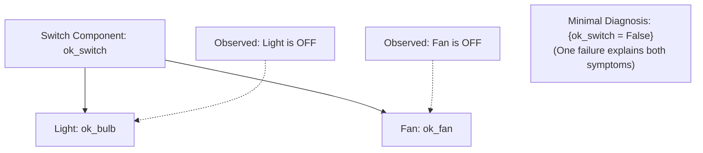

---

### 8.6 Python Reference: Forward Chaining Engine

```python
def forward_chaining(facts, rules, query):
    inferred = set(facts)
    changed = True

    while changed:
        changed = False
        for head, body in rules:
            if head not in inferred and all(atom in inferred for atom in body):
                inferred.add(head)
                changed = True
                if head == query:
                    return True, inferred

    return query in inferred, inferred

kb_facts = {'breaker_ok', 'switch_up'}
kb_rules = [
    ('power_ok', ['breaker_ok']),
    ('light_on', ['switch_up', 'power_ok'])
]

success, conclusions = forward_chaining(kb_facts, kb_rules, 'light_on')
print(f"Query Proved: {success} | Derived Knowledge Base: {conclusions}")
```

---

## Chapter 09 — Classical Planning with Certainty

> **In One Line:** Classical planning determines an organized sequence of actions that transitions an agent from an initial state to a goal state in deterministic, fully observable worlds.

### 9.1 Action Representations & The STRIPS Assumption

```
STRIPS Action Schema ──┬── Action Name: Operator identification
                       ├── Preconditions: Predicates that MUST be satisfied prior to execution
                       └── Effects: Changes made to state (Add-List & Delete-List)
```

> [!NOTE]
> **The STRIPS Frame Assumption:**
> Any world literal not explicitly stated in an action's Add or Delete list remains unchanged after action execution.

#### Coffee Delivery Robot Problem Specification

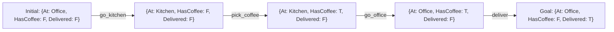

| Action | Preconditions | Add List (Effects True) | Delete List (Effects False) |
| :--- | :--- | :--- | :--- |
| `go_kitchen` | `At = Office` | `At = Kitchen` | `At = Office` |
| `go_office` | `At = Kitchen` | `At = Office` | `At = Kitchen` |
| `pick_coffee`| `At = Kitchen`, `HasCoffee = F` | `HasCoffee = T` | `HasCoffee = F` |
| `deliver` | `At = Office`, `HasCoffee = T` | `Delivered = T`, `HasCoffee = F` | `HasCoffee = T` |

---

### 9.2 Forward State-Space Planning vs Backward Planning

- **Forward Planning (Progression):** Searches forward from $S_0$ by exploring applicable actions. (Sound and complete, but suffers from large branching factors).
- **Backward Planning (Regression):** Searches backwards from Goal by identifying relevant operators achieving goal literals. (Prunes irrelevant actions).

---

### 9.3 Python Reference: STRIPS Planning Engine

```python
class Action:
    def __init__(self, name, preconds, add_list, del_list):
        self.name = name
        self.preconds = set(preconds)
        self.add_list = set(add_list)
        self.del_list = set(del_list)

    def is_applicable(self, state):
        return self.preconds.issubset(state)

    def apply(self, state):
        return (state - self.del_list) | self.add_list

def plan_forward(initial_state, goal_state, actions):
    from collections import deque
    queue = deque([(initial_state, [])])
    visited = [initial_state]

    while queue:
        state, plan = queue.popleft()
        if goal_state.issubset(state):
            return plan

        for action in actions:
            if action.is_applicable(state):
                next_state = action.apply(state)
                if next_state not in visited:
                    visited.append(next_state)
                    queue.append((next_state, plan + [action.name]))
    return None

actions = [
    Action('go_kitchen', ['At_Office'], ['At_Kitchen'], ['At_Office']),
    Action('go_office', ['At_Kitchen'], ['At_Office'], ['At_Kitchen']),
    Action('pick_coffee', ['At_Kitchen', 'No_Coffee'], ['Has_Coffee'], ['No_Coffee']),
    Action('deliver', ['At_Office', 'Has_Coffee'], ['Delivered', 'No_Coffee'], ['Has_Coffee'])
]

init = {'At_Office', 'No_Coffee'}
goal = {'Delivered'}
plan = plan_forward(init, goal, actions)
print("Synthesized Plan:", plan)
# Output: ['go_kitchen', 'pick_coffee', 'go_office', 'deliver']
```

---

## Chapter 10 — Reasoning Under Uncertainty

> **In One Line:** Probability theory, Bayesian Networks, Markov Decision Processes, and HMMs allow agents to quantify uncertainty, update beliefs, and make optimal sequential decisions.

### 10.1 Probability Basics & Bayes' Rule

$$P(A \mid B) = \frac{P(A \land B)}{P(B)} \qquad\Longrightarrow\qquad P(H \mid E) = \frac{P(E \mid H) \cdot P(H)}{P(E)}$$

#### High-Yield Medical Diagnosis Example

- Prior probability of disease: $P(D) = 0.01$. Test sensitivity: $P(+ \mid D) = 0.90$. False positive rate: $P(+ \mid \neg D) = 0.05$.

$$P(+) = P(+ \mid D)P(D) + P(+ \mid \neg D)P(\neg D) = (0.90)(0.01) + (0.05)(0.99) = 0.009 + 0.0495 = \mathbf{0.0585}$$
$$P(D \mid +) = \frac{P(+ \mid D)P(D)}{P(+)} = \frac{0.009}{0.0585} \approx \mathbf{15.38\%}$$

---

### 10.2 Conditional Independence & Network Topologies

```
Chain: A ──► B ──► C          Fork: A ◄── B ──► C          Collider: A ──► B ◄── C
(A ⊥ C | B: Independent given B) (A ⊥ C | B: Independent given B) (A ⊥ C: Indep; Dependent given B!)
```

> [!IMPORTANT]
> **Explaining Away (The Collider Property):**
> In a collider network ($\text{Burglary} \rightarrow \text{Alarm} \leftarrow \text{Earthquake}$), Burglary and Earthquake are initially independent. However, conditioning on $\text{Alarm} = \text{True}$ creates dependency: confirming an Earthquake explains away the alarm, decreasing the posterior probability of a Burglary.

---

### 10.3 Bayesian Belief Networks (BBN)

A Bayesian Network represents a joint probability distribution over DAG variables:

$$P(X_1, X_2, \dots, X_n) = \prod_{i=1}^{n} P(X_i \mid \text{Parents}(X_i))$$

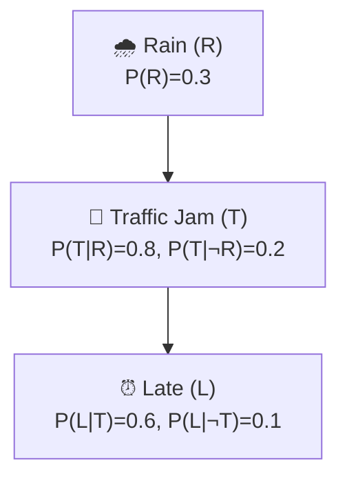

#### Diagnostic Query Computation: $P(R \mid L)$

1. $P(T) = (0.3)(0.8) + (0.7)(0.2) = 0.24 + 0.14 = \mathbf{0.38}$
2. $P(L) = P(L \mid T)P(T) + P(L \mid \neg T)P(\neg T) = (0.6)(0.38) + (0.1)(0.62) = 0.228 + 0.062 = \mathbf{0.29}$
3. $P(L \mid R) = (0.8)(0.6) + (0.2)(0.1) = 0.48 + 0.02 = \mathbf{0.50}$
4. **Bayes Rule Application:**
   $$P(R \mid L) = \frac{P(L \mid R) P(R)}{P(L)} = \frac{(0.50)(0.30)}{0.29} \approx \mathbf{51.72\%}$$

---

### 10.4 Bayesian Parameter Learning

For complete data, maximum likelihood parameters are calculated directly via counting with **Laplace Add-One Smoothing**:

$$P_{\text{Laplace}}(X = v \mid \text{Parent}) = \frac{\text{Count}(X = v, \text{Parent}) + 1}{\text{Count}(\text{Parent}) + |D_X|}$$

---

### 10.5 Markov Decision Processes (MDPs) & The Bellman Equation

An MDP is defined by $\langle S, A, T, R, \gamma \rangle$.

$$V^*(s) = \max_{a \in A} \sum_{s'} P(s' \mid s, a) \left[ R(s, a, s') + \gamma V^*(s') \right]$$

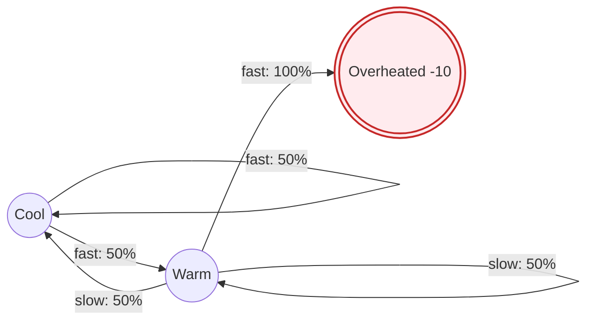

---

### 10.6 Hidden Markov Models (HMMs)

HMM assumes true system state $X_t$ is hidden; agent only receives observations $E_t$.

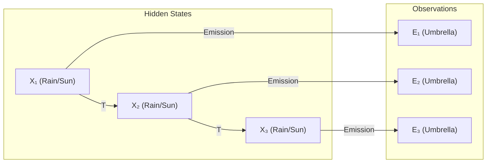

- **Forward Algorithm (Filtering):** Computes current belief state $P(X_t \mid e_{1:t})$.
- **Viterbi Algorithm (Decoding):** Finds most probable sequence of hidden states $\arg\max_{X_{1:t}} P(X_{1:t} \mid e_{1:t})$.

---

### 10.7 Python Reference: Bayesian & HMM Computing

```python
# HMM Forward Algorithm (Filtering) for Umbrella Example
# States: 0: Rain, 1: Sun
P_init = [0.5, 0.5]
T_matrix = [[0.7, 0.3],   # P(X_t | Rain_{t-1})
            [0.3, 0.7]]   # P(X_t | Sun_{t-1})
E_matrix = [[0.9, 0.1],   # P(Umbrella | Rain), P(No | Rain)
            [0.2, 0.8]]   # P(Umbrella | Sun), P(No | Sun)

# Day 1: Umbrella observed
f1_rain = P_init[0] * E_matrix[0][0]
f1_sun  = P_init[1] * E_matrix[1][0]
norm1 = f1_rain + f1_sun
f1 = [f1_rain / norm1, f1_sun / norm1]
print(f"Day 1 Belief P(Rain|U1): {f1[0]:.4f}")  # Output: 0.8182

# Day 2: Umbrella observed
pred_rain = f1[0] * T_matrix[0][0] + f1[1] * T_matrix[1][0]
pred_sun  = f1[0] * T_matrix[0][1] + f1[1] * T_matrix[1][1]
f2_rain = pred_rain * E_matrix[0][0]
f2_sun  = pred_sun * E_matrix[1][0]
norm2 = f2_rain + f2_sun
f2 = [f2_rain / norm2, f2_sun / norm2]
print(f"Day 2 Belief P(Rain|U1, U2): {f2[0]:.4f}")  # Output: 0.8829
```

---

## Chapter 11 — Reinforcement Learning (RL)

> **In One Line:** Reinforcement learning solves unknown MDPs through trial-and-error interactions, balancing exploration of novel actions with exploitation of rewarded behaviors.

### 11.1 The Reinforcement Learning Paradigm

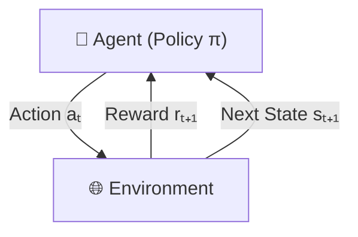

- **Credit Assignment Problem:** Determining which past action sequence deserved praise for delayed terminal rewards.
- **Model-Free vs Model-Based:** Model-free RL learns value functions directly without constructing explicit transition/reward tables.

---

### 11.2 Passive vs Active RL, TD-Learning & SARSA

#### Temporal Difference (TD) Learning Update
$$V(s) \leftarrow V(s) + \alpha \left[ \underbrace{r + \gamma V(s')}_{\text{TD Target}} - \underbrace{V(s)}_{\text{Estimate}} \right]$$

#### SARSA (On-Policy TD Control)
$$Q(s, a) \leftarrow Q(s, a) + \alpha \left[ r + \gamma Q(s', a') - Q(s, a) \right]$$
*(Updates using the actual action $a'$ chosen by the exploratory policy).*

---

### 11.3 Exploration vs Exploitation ($\epsilon$-Greedy)

$$a = \begin{cases} \arg\max_{a'} Q(s, a') & \text{with probability } 1 - \epsilon \quad \text{(Exploit)} \\ \text{Random Action} & \text{with probability } \epsilon \quad \text{(Explore)} \end{cases}$$

---

### 11.4 Q-Learning (Off-Policy TD Control)

$$Q(s, a) \leftarrow Q(s, a) + \alpha \left[ r + \gamma \max_{a'} Q(s', a') - Q(s, a) \right]$$

```mermaid
flowchart TD
    Init[Initialize Q Table Q_s_a = 0] --> LoopState[Observe Current State s]
    LoopState --> ChooseAct[Select action a via ε-greedy]
    ChooseAct --> ExecAct[Execute a: Observe r and s']
    ExecAct --> UpdateQ["Q(s,a) ← Q(s,a) + α [r + γ max_a' Q(s',a') - Q(s,a)]"]
    UpdateQ --> NextState[s ← s']
    NextState --> EndCheck{Episode Terminal?}
    EndCheck -- No --> ChooseAct
    EndCheck -- Yes --> LoopState
```

#### Step-by-Step Two-Episode Trace (Corridor World)
- Environment: $A \rightarrow B \rightarrow C \text{ (Goal)}$. Step cost $r = -1$, reaching $C$ gives $r = +10$. $\alpha = 0.5, \gamma = 0.9$. All initial $Q = 0$.

| Episode | Step / Transition | Q-Update Equation | New $Q(s, a)$ Value |
| :---: | :---: | :--- | :--- |
| **Ep 1** | $A \rightarrow B, r=-1$ | $0 + 0.5[-1 + 0.9(0) - 0]$ | $Q(A, \text{right}) = \mathbf{-0.5}$ |
| **Ep 1** | $B \rightarrow C, r=+10$| $0 + 0.5[10 + 0.9(0) - 0]$ | $Q(B, \text{right}) = \mathbf{+5.0}$ |
| **Ep 2** | $A \rightarrow B, r=-1$ | $-0.5 + 0.5[-1 + 0.9(5.0) - (-0.5)]$ | $Q(A, \text{right}) = \mathbf{+1.5}$ |
| **Ep 2** | $B \rightarrow C, r=+10$| $5.0 + 0.5[10 + 0.9(0) - 5.0]$ | $Q(B, \text{right}) = \mathbf{+7.5}$ |

---

### 11.5 Python Reference: Tabular Q-Learning Engine

```python
import numpy as np

# Corridor: State 0 (A), State 1 (B), State 2 (C - Terminal Goal)
num_states = 3
num_actions = 1  # 0: move right
Q = np.zeros((num_states, num_actions))

alpha = 0.5
gamma = 0.9

episodes = [
    [(0, 0, -1, 1), (1, 0, 10, 2)],  # Ep 1: (s, a, r, s')
    [(0, 0, -1, 1), (1, 0, 10, 2)]   # Ep 2: (s, a, r, s')
]

for ep_idx, episode in enumerate(episodes):
    for s, a, r, next_s in episode:
        max_q_next = 0.0 if next_s == 2 else np.max(Q[next_s])
        td_target = r + gamma * max_q_next
        Q[s, a] += alpha * (td_target - Q[s, a])

print("Trained Q-Table:")
print(f"Q(State A, Right): {Q[0, 0]:.2f}")  # Output: 1.50
print(f"Q(State B, Right): {Q[1, 0]:.2f}")  # Output: 7.50
```

---

## 🏆 Master Exam Cheat Sheet & Formulas

### 1. Algorithm Complexity Matrix

| Algorithm | Frontier Data Structure | Complete? | Optimal? | Time Complexity | Space Complexity |
| :--- | :--- | :---: | :---: | :---: | :---: |
| **BFS** | FIFO Queue | **Yes** (if $b < \infty$) | **Yes** (for uniform step costs) | $O(b^d)$ | $O(b^d)$ |
| **DFS** | LIFO Stack / Recursion | **No** (infinite trees) | **No** | $O(b^m)$ | $O(b \cdot m)$ |
| **UCS** | Priority Queue by $g(n)$ | **Yes** (if $c \ge \epsilon > 0$) | **Yes** (general non-negative costs) | $O(b^{1 + \lfloor C^*/\epsilon \rfloor})$ | $O(b^{1 + \lfloor C^*/\epsilon \rfloor})$ |
| **IDS** | Repeated Depth Bounds | **Yes** | **Yes** (uniform costs) | $O(b^d)$ | $O(b \cdot d)$ |
| **Greedy** | Priority Queue by $h(n)$ | **No** | **No** | $O(b^m)$ | $O(b^m)$ |
| **A\*** | Priority Queue by $g(n) + h(n)$ | **Yes** | **Yes** (admissible/consistent $h$) | $O(b^d)$ | $O(b^d)$ |
| **IDA\*** | Depth-first bounded by $f$ | **Yes** | **Yes** | $O(b^d)$ | $O(b \cdot d)$ |
| **Minimax**| Game Tree Recursion | **Yes** (finite game) | **Yes** (vs optimal opponent) | $O(b^m)$ | $O(b \cdot m)$ |
| **Alpha-Beta**| Pruned Recursion ($\alpha, \beta$) | **Yes** | **Yes** (same as Minimax) | $O(b^{m/2})$ *(best case)* | $O(b \cdot m)$ |

---

### 2. High-Yield Formula Reference

| Name | Mathematical Equation | Key Use / Context |
| :--- | :--- | :--- |
| **Heuristic Admissibility** | $0 \le h(n) \le h^*(n)$ | Guarantees Tree-Search A\* optimality |
| **Heuristic Consistency** | $h(n) \le c(n, n') + h(n')$ | Guarantees Graph-Search A\* optimality |
| **Simulated Annealing** | $P(\text{accept}) = e^{\Delta E / T}$ | Escaping local optima in stochastic search |
| **Bayes' Rule** | $P(H \mid E) = \frac{P(E \mid H)P(H)}{P(E)}$ | Inverse conditional probability updating |
| **Bayes Net Joint** | $P(X_1, \dots, X_n) = \prod_{i=1}^n P(X_i \mid \text{Parents}(X_i))$ | Factorizing full joint distribution |
| **Bellman Equation** | $V^*(s) = \max_a \sum_{s'} P(s' \mid s, a)[R(s, a, s') + \gamma V^*(s')]$ | Value iteration for optimal MDP policy |
| **Q-Learning Update** | $Q(s,a) \leftarrow Q(s,a) + \alpha [r + \gamma \max_{a'} Q(s',a') - Q(s,a)]$ | Model-free off-policy reinforcement learning |
| **Delta Rule (Backprop)** | $\delta = (y - t) \cdot y(1 - y) \quad\Longrightarrow\quad w_i \leftarrow w_i - \eta \delta x_i$ | Neural network gradient descent weight update |

---

<p align="center">
  <b>CSE366 Artificial Intelligence Study Guide</b><br>
  Built with ❤️ for academic excellence. Happy Studying & Best of Luck with your Exams!
</p>
